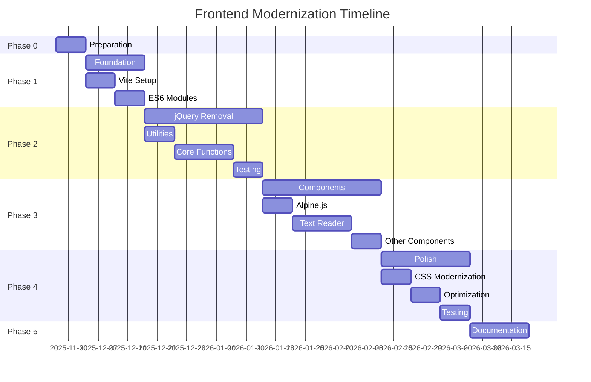

# Frontend Modernization Plan

**Project:** Learning with Texts (LWT)
**Document Version:** 2.0
**Last Updated:** November 26, 2025
**Status:** Phase 0 Complete - Foundation Established

---

## Table of Contents

1. [Executive Summary](#executive-summary)
2. [Current State Analysis](#current-state-analysis)
3. [Modernization Goals](#modernization-goals)
4. [Technology Stack Decisions](#technology-stack-decisions)
5. [Migration Phases](#migration-phases)
6. [Implementation Details](#implementation-details)
7. [Risk Management](#risk-management)
8. [Success Metrics](#success-metrics)
9. [Timeline & Milestones](#timeline--milestones)
10. [Resources & References](#resources--references)

---

## Executive Summary

This document outlines a comprehensive plan to modernize the Learning with Texts (LWT) frontend codebase. The current implementation relies on jQuery and outdated patterns from 2010-2015. This modernization will improve performance, maintainability, and developer experience while maintaining backward compatibility during the transition.

**Key Objectives:**

- ✅ Modernize build system (Vite) - **COMPLETE**
- ✅ Add TypeScript for type safety - **COMPLETE**
- Convert to ES6+ modules (incremental)
- Keep jQuery 1.12.4 from npm (minimize breaking changes during transition)
- Improve CSS organization and theming
- Enhance code maintainability and testability

**Risk Level:** Medium (mitigated through phased approach)
**Expected ROI:** High (improved DX, performance, maintainability)

> **Note:** The original plan suggested removing jQuery. After discussion, the decision was made to **keep jQuery 1.12.4** from npm to minimize breaking changes during the initial modernization. jQuery removal can be considered in a future phase.

---

## Current State Analysis

### Architecture Overview

**JavaScript:**

- **Total Lines:** ~3,500 lines across 7 main files
- **Module System:** None (global scope)
- **Framework:** jQuery 1.x/2.x era
- **State Management:** Scattered global objects
- **Build Process:** Composer-based minification

**Key Files:**

```test
src/frontend/js/
├── pgm.js                    (663 lines) - Core utilities
├── jq_pgm.js                 (1,435 lines) - jQuery functions
├── text_events.js            (699 lines) - Text reading interactions
├── audio_controller.js       (125 lines) - Audio playback
├── translation_api.js        (183 lines) - Translation APIs
├── user_interactions.js      (385 lines) - UI interactions
├── overlib_interface.js      - Popup library (deprecated)
└── third_party/
    ├── countuptimer.js
    └── sorttable.js
```

**CSS:**

```text
src/frontend/css/
├── styles.css                - Main stylesheet
├── css_charts.css            - Chart visualizations
├── feed_wizard.css           - Feed wizard UI
├── gallery.css               - Gallery styles
├── jplayer.css               - Audio player
├── jquery-ui.css             - jQuery UI widgets
└── jquery.tagit.css          - Tag input widget

src/frontend/themes/
├── chaosarium_light/
├── Default_Mod/
├── Lingocracy/
├── Lingocracy_Dark/
├── Night_Mode/
└── White_Night/
```

**Dependencies:**

- jQuery 1.x/2.x (~85KB minified)
- jQuery UI (~250KB with CSS)
- jPlayer (audio player)
- jQuery plugins: jeditable, tagit, scrollTo, hoverIntent, xpath
- Overlib (20+ year old popup library)

### Critical Issues

#### 1. Global Namespace Pollution

```javascript
// Current approach - everything global
WID = 0;
TID = 0;
WBLINK1 = '';
LWT_DATA = { /* large object */ };

// Functions in global scope
function createTheDictUrl(u, w) { ... }
function translateWord(url, wordctl) { ... }
```

#### 2. Heavy jQuery Dependency

- Every DOM operation uses jQuery
- Modern vanilla JS equivalents available
- Performance overhead
- Security concerns (outdated version)

#### 3. Inline Event Handlers

```javascript
// PHP generates JavaScript inline
onclick="owin('trans.php?x=1&i=' + ord)"
onclick="updateTermTranslation(<?php echo $wid; ?>, '#tx<?php echo $i; ?>');"
```

#### 4. No Code Splitting

- All JavaScript loaded on every page
- No lazy loading
- Large initial bundle

#### 5. Legacy Libraries

- **Overlib:** Unmaintained since 2005
- **jQuery UI:** Last major update 2016
- **jPlayer:** Better alternatives exist

#### 6. Poor Separation of Concerns

```javascript
// Business logic mixed with DOM manipulation
function do_ajax_edit_impr_text(pagepos, word, term_id) {
  $('#editimprtextdata').html('');
  $.getJSON('api.php/v1/terms/' + term_id + '/translations', ...)
    .then(function(data) {
      edit_term_ann_translations(data, textid);
      $.scrollTo(pagepos);
      // Direct DOM manipulation in AJAX callback
    });
}
```

### Technical Debt Metrics

| Metric | Value | Target | Notes |
|--------|-------|--------|-------|
| Bundle Size (JS) | ~600KB | <200KB | With jQuery and plugins |
| Initial Load Time | ~2.5s | <1s | On 3G connection |
| Dependencies Outdated | 8/10 | 0/10 | Security risk |
| Code Duplication | ~30% | <10% | Similar patterns repeated |
| Test Coverage | 0% | >70% | Frontend untested |
| Accessibility Score | 65/100 | >90/100 | Using Lighthouse |

---

## Modernization Goals

### Primary Goals

1. **Performance Improvement**
   - Reduce bundle size by 60% (from ~600KB to ~240KB)
   - Achieve <1s initial load time on 3G
   - Implement code splitting and lazy loading
   - Improve runtime performance (faster interactions)

2. **Code Quality**
   - Establish clear module boundaries
   - Implement component-based architecture
   - Achieve >70% test coverage
   - Reduce code duplication to <10%

3. **Developer Experience**
   - Hot Module Replacement (instant feedback)
   - Modern IDE support (autocomplete, refactoring)
   - Type safety (optional TypeScript)
   - Clear project structure

4. **Maintainability**
   - Remove deprecated dependencies
   - Document component APIs
   - Establish coding standards
   - Create reusable component library

5. **User Experience**
   - Faster page interactions
   - Better mobile support
   - Improved accessibility (WCAG 2.1 AA)
   - Modern UI patterns

### Non-Goals (Out of Scope)

- ❌ Complete UI redesign (visual changes minimal)
- ❌ Backend refactoring (PHP code unchanged unless necessary)
- ❌ Database schema changes
- ❌ Breaking existing functionality
- ❌ Major feature additions during migration

---

## Technology Stack Decisions

### Build System: **Vite** ✅

**Why Vite:**

- Lightning-fast HMR (<100ms updates)
- Simple configuration
- Excellent ES modules support
- Built-in optimizations
- Active development and community

**Alternatives Considered:**

- Webpack (too complex, slower)
- Rollup (less DX features)
- Parcel (less control)

### JavaScript: **ES6+ Modules** ✅

**Standards:**

- ES6+ syntax (const/let, arrow functions, classes)
- Native modules (import/export)
- Modern APIs (fetch, async/await)
- No transpilation unless needed (target modern browsers)

**Browser Support:**

- Chrome/Edge 90+
- Firefox 88+
- Safari 14+
- No IE11 support

### Framework Decision: **Alpine.js** ✅ (Primary Recommendation)

**Why Alpine.js:**

- Minimal learning curve
- Works with existing HTML structure
- Small footprint (~15KB gzipped)
- No build step required (but we'll use one)
- Progressive enhancement friendly
- Excellent for incremental adoption

**Example Usage:**

```html
<div x-data="wordReader()">
  <template x-for="word in words" :key="word.id">
    <span 
      :class="`word status${word.status}`"
      @click="selectWord(word)"
      x-text="word.text"
    ></span>
  </template>
</div>

<script>
  function wordReader() {
    return {
      words: [],
      async init() {
        this.words = await fetchWords();
      },
      selectWord(word) {
        // Handle word click
      }
    }
  }
</script>
```

**Alternative Options:**

| Framework | Pros | Cons | Recommendation |
|-----------|------|------|----------------|
| **Alpine.js** | Minimal, progressive, easy migration | Less powerful for complex UIs | ⭐ **Primary Choice** |
| **Vue 3** | Powerful, great docs, large ecosystem | Steeper learning curve, more refactoring | ⭐ **Alternative** |
| **Lit** | Web Components, framework-agnostic | Smaller ecosystem, more boilerplate | Consider for components |
| **React** | Huge ecosystem, job market | Requires complete rewrite, larger bundle | ❌ Not recommended |
| **Svelte** | Smallest bundles, great DX | Less mature, harder migration | ❌ Not recommended |

### CSS: **Modern CSS + CSS Variables**

**Approach:**

- CSS Custom Properties for theming
- Modern CSS features (Grid, Flexbox, Container Queries)
- Sass for preprocessing (optional)
- CSS Modules for component isolation (with Vite)

**No CSS Framework Initially** (evaluate later):

- Keep existing styles during migration
- Add utility classes gradually if needed
- Consider Tailwind CSS in Phase 4+ only

### State Management: **Custom Lightweight Store**

**Approach:**

- Simple event-emitter pattern
- Reactive state updates
- Minimal API surface
- ~50 lines of code

**Why Not Redux/Pinia:**

- Overkill for current needs
- Additional learning curve
- Can migrate later if needed

### Testing: **Vitest + Testing Library**

**Tools:**

- Vitest (Vite-native test runner)
- @testing-library/dom (DOM testing utilities)
- Playwright (E2E tests)

---

## Migration Phases

### Phase 0: Foundation Setup ✅ **COMPLETE**

**Goals:**

- Set up Vite build system alongside existing PHP minifier
- Add TypeScript support
- Move vendored libraries to npm
- Create PHP integration for conditional asset loading

**Completed Tasks:**

1. ✅ Install Node.js dependencies (Vite, TypeScript, jQuery from npm)
2. ✅ Set up Vite configuration with legacy browser support
3. ✅ Create TypeScript configuration
4. ✅ Create type declarations for PHP-injected globals
5. ✅ Create PHP helper for Vite asset loading
6. ✅ Modify `ui_helpers.php` for conditional asset loading

**Files Created/Modified:**

```text
package.json              # Updated with Vite, TypeScript, jQuery 1.12.4, jquery-ui-dist 1.12.1
tsconfig.json             # NEW - TypeScript configuration
vite.config.ts            # NEW - Vite build configuration
src/frontend/js/main.ts   # NEW - Vite entry point
src/frontend/js/types/globals.d.ts  # NEW - Type declarations for LWT_DATA, STATUSES, etc.
src/backend/Core/vite_helper.php    # NEW - PHP helper functions
src/backend/Core/ui_helpers.php     # Modified - conditional Vite/legacy loading
```

**Key Implementation Details:**

```typescript
// vite.config.ts - Key configuration
export default defineConfig({
  root: resolve(__dirname, 'src/frontend'),
  build: {
    outDir: resolve(__dirname, 'assets'),
    emptyOutDir: false,
    manifest: true,
    rollupOptions: {
      input: { main: resolve(__dirname, 'src/frontend/js/main.ts') },
      output: {
        entryFileNames: 'js/vite/[name].[hash].js',
        chunkFileNames: 'js/vite/chunks/[name].[hash].js',
        assetFileNames: 'css/vite/[name].[hash][extname]'
      }
    }
  },
  plugins: [legacy({ targets: ['defaults', 'not IE 11'] })],
  server: { port: 5173 }
});
```

```php
// PHP asset loading (vite_helper.php)
function should_use_vite(): bool {
    $mode = getenv('LWT_ASSET_MODE') ?: 'auto';
    if ($mode === 'legacy') return false;
    if ($mode === 'vite') return true;
    return get_vite_manifest() !== null;  // Auto-detect
}
```

**Environment Variables:**

- `LWT_ASSET_MODE`: `vite` | `legacy` | `auto` (default: auto)
- `VITE_DEV_MODE`: Set to enable dev server detection

**NPM Scripts:**

```bash
npm run dev        # Start Vite dev server with HMR
npm run build      # Build production assets to assets/
npm run preview    # Preview production build
npm run typecheck  # Run TypeScript type checking
```

**Testing Results:**

- ✅ `npm run build` produces: `assets/js/vite/main.[hash].js`, `assets/css/vite/main.[hash].css`
- ✅ Manifest generated at `assets/.vite/manifest.json`
- ✅ PHP tests pass
- ✅ Legacy asset loading still works (backward compatible)

---

### Phase 1: TypeScript Migration 🔨 **NEXT PHASE**

**Goals:**

- Incrementally convert JavaScript files to TypeScript
- Add type safety to existing code
- Maintain backward compatibility with global exports

**Strategy:**

Since the Vite build system is now in place, we can incrementally migrate files:

1. Start with utility files (lowest risk)
2. Move to API/data handling files
3. Finally migrate DOM interaction files

#### Task 1.1: Migrate `pgm.js` → `pgm.ts`

**Priority files to migrate:**

```text
src/frontend/js/pgm.js            → src/frontend/js/pgm.ts
src/frontend/js/translation_api.js → src/frontend/js/translation_api.ts
src/frontend/js/audio_controller.js → src/frontend/js/audio_controller.ts
```

**Migration pattern:**

```typescript
// Before: pgm.js (global scope)
function createTheDictUrl(u, w) {
  // ...
}

// After: pgm.ts (typed, exported, but also global for legacy support)
export function createTheDictUrl(url: string, word: string): string {
  // ...
}

// Legacy global export (temporary, for PHP templates)
if (typeof window !== 'undefined') {
  (window as any).createTheDictUrl = createTheDictUrl;
}
```

#### Task 1.2: Update main.ts Entry Point

The entry point imports migrated modules and exposes globals for legacy code:

```typescript
// src/frontend/js/main.ts (current implementation)
import '../css/styles.css';
import '../css/jquery-ui.css';
import '../css/jquery.tagit.css';
import '../css/feed_wizard.css';

import $ from 'jquery';
import 'jquery-ui-dist/jquery-ui';

// Import migrated TypeScript modules
import * as pgm from './pgm';           // After migration
import * as translation from './translation_api';

// Expose jQuery globally (required for legacy code)
declare global {
  interface Window {
    $: typeof $;
    jQuery: typeof $;
    LWT_VITE_LOADED: boolean;
  }
}
window.$ = $;
window.jQuery = $;
window.LWT_VITE_LOADED = true;

// Initialize when DOM ready
document.addEventListener('DOMContentLoaded', () => {
  console.log('LWT Vite bundle loaded');
});
```

**Planned Module Structure:**

```text
src/frontend/js/
├── main.ts                     # Entry point (EXISTS)
├── types/
│   └── globals.d.ts            # Type declarations (EXISTS)
├── pgm.ts                      # Migrated from pgm.js
├── jq_pgm.ts                   # Migrated from jq_pgm.js
├── text_events.ts              # Migrated from text_events.js
├── audio_controller.ts         # Migrated from audio_controller.js
├── translation_api.ts          # Migrated from translation_api.js
├── user_interactions.ts        # Migrated from user_interactions.js
└── utils/                      # New utility modules (optional refactor)
    ├── dictionary.ts
    ├── status.ts
    └── cookies.ts
```

#### Task 1.3: Add Type Definitions for LWT_DATA

The `globals.d.ts` file (already created) provides type safety for PHP-injected globals:

```typescript
// src/frontend/js/types/globals.d.ts (EXISTS)
export interface LwtData {
  language: LwtLanguage;
  text: LwtText;
  word: LwtWord;
  test: LwtTest;
  settings: LwtSettings;
}

declare global {
  interface Window {
    STATUSES: Record<string, WordStatus>;
    TAGS: Record<string, string>;
    TEXTTAGS: Record<string, string>;
    LWT_DATA: LwtData;
  }
}
```

#### Task 1.4: Migrate Files One at a Time

**Migration Order (by complexity):**

1. `audio_controller.js` (125 lines) - Standalone, minimal dependencies
2. `translation_api.js` (183 lines) - API utilities
3. `pgm.js` (663 lines) - Core utilities
4. `user_interactions.js` (385 lines) - UI interactions
5. `text_events.js` (699 lines) - Complex DOM interactions
6. `jq_pgm.js` (1,435 lines) - Heavy jQuery usage, migrate last

**For each file:**

1. Rename `.js` → `.ts`
2. Add type annotations to function parameters/returns
3. Fix TypeScript errors
4. Import in `main.ts`
5. Test that existing functionality works
6. Run `npm run typecheck` to verify

**Phase 1 Deliverables:**

- [ ] Core utility files converted to TypeScript
- [ ] Type safety for LWT_DATA and global state
- [ ] `npm run typecheck` passes with no errors
- [ ] Legacy PHP templates still work (globals exposed)

**Success Criteria:**

- [ ] `npm run dev` starts dev server with HMR
- [ ] `npm run build` produces optimized bundles
- [ ] `npm run typecheck` passes
- [ ] All existing functionality still works
- [ ] No console errors on any page

---

### Phase 2: Build Pipeline Integration 🔧 **OPTIONAL**

**Goals:**

- Update `composer.json` to use Vite build
- Integrate Vite output with existing deployment workflow
- Add development workflow documentation

> **Note:** jQuery removal was originally planned for this phase. Since we're keeping jQuery 1.12.4 from npm for backward compatibility, this phase focuses on build pipeline integration instead. jQuery removal can be considered as a future enhancement.

---

### Phase 3 (Future): jQuery Removal 🎯 **DEFERRED**

**Goals (if pursued later):**

- Replace jQuery DOM manipulation with vanilla JS
- Replace jQuery AJAX with Fetch API
- Remove jQuery dependencies
- Maintain functionality

#### Task 2.1: Create jQuery Replacement Utilities

**DOM Utilities:**

```javascript
// src/frontend/js/utils/dom.js

/**
 * Query selector shortcuts
 */
export const $ = (selector, context = document) => 
  context.querySelector(selector);

export const $$ = (selector, context = document) => 
  Array.from(context.querySelectorAll(selector));

/**
 * Element creation
 */
export function createElement(tag, attrs = {}, children = []) {
  const el = document.createElement(tag);
  
  Object.entries(attrs).forEach(([key, value]) => {
    if (key === 'className') {
      el.className = value;
    } else if (key === 'dataset') {
      Object.assign(el.dataset, value);
    } else if (key.startsWith('on')) {
      el.addEventListener(key.slice(2).toLowerCase(), value);
    } else {
      el.setAttribute(key, value);
    }
  });
  
  children.forEach(child => {
    el.appendChild(
      typeof child === 'string' ? document.createTextNode(child) : child
    );
  });
  
  return el;
}

/**
 * Class manipulation
 */
export function addClass(element, ...classes) {
  element.classList.add(...classes);
}

export function removeClass(element, ...classes) {
  element.classList.remove(...classes);
}

export function toggleClass(element, className) {
  element.classList.toggle(className);
}

export function hasClass(element, className) {
  return element.classList.contains(className);
}

/**
 * Event delegation
 */
export function delegate(parent, selector, event, handler) {
  parent.addEventListener(event, (e) => {
    const target = e.target.closest(selector);
    if (target) {
      handler.call(target, e);
    }
  });
}

/**
 * Show/hide
 */
export function show(element) {
  element.style.display = '';
}

export function hide(element) {
  element.style.display = 'none';
}

/**
 * AJAX shorthand
 */
export async function getJSON(url, params = {}) {
  const query = new URLSearchParams(params).toString();
  const response = await fetch(`${url}${query ? '?' + query : ''}`);
  if (!response.ok) throw new Error(`HTTP ${response.status}`);
  return response.json();
}

export async function postJSON(url, data = {}) {
  const response = await fetch(url, {
    method: 'POST',
    headers: { 'Content-Type': 'application/json' },
    body: JSON.stringify(data)
  });
  if (!response.ok) throw new Error(`HTTP ${response.status}`);
  return response.json();
}

/**
 * Scroll utilities
 */
export function scrollTo(element, options = {}) {
  element.scrollIntoView({
    behavior: 'smooth',
    block: 'center',
    ...options
  });
}
```

**API Client:**

```javascript
// src/frontend/js/api/client.js

class APIClient {
  constructor(baseURL = '/api.php/v1') {
    this.baseURL = baseURL;
  }

  async request(endpoint, options = {}) {
    const url = `${this.baseURL}${endpoint}`;
    const config = {
      headers: {
        'Content-Type': 'application/json',
        ...options.headers
      },
      ...options
    };

    try {
      const response = await fetch(url, config);
      
      if (!response.ok) {
        throw new APIError(
          `HTTP ${response.status}: ${response.statusText}`,
          response.status
        );
      }

      return await response.json();
    } catch (error) {
      if (error instanceof APIError) throw error;
      throw new APIError('Network error', 0, error);
    }
  }

  get(endpoint, params = {}) {
    const query = new URLSearchParams(params).toString();
    return this.request(
      `${endpoint}${query ? '?' + query : ''}`,
      { method: 'GET' }
    );
  }

  post(endpoint, data = {}) {
    return this.request(endpoint, {
      method: 'POST',
      body: JSON.stringify(data)
    });
  }

  put(endpoint, data = {}) {
    return this.request(endpoint, {
      method: 'PUT',
      body: JSON.stringify(data)
    });
  }

  delete(endpoint) {
    return this.request(endpoint, { method: 'DELETE' });
  }
}

class APIError extends Error {
  constructor(message, status, originalError = null) {
    super(message);
    this.name = 'APIError';
    this.status = status;
    this.originalError = originalError;
  }
}

export const api = new APIClient();
```

**Terms API:**

```javascript
// src/frontend/js/api/terms.js
import { api } from './client.js';

export async function getTermTranslations(termId, textId, termLc) {
  return api.get(`/terms/${termId}/translations`, {
    text_id: textId,
    term_lc: termLc
  });
}

export async function updateTermTranslation(termId, translation) {
  return api.post(`/terms/${termId}/translations`, { translation });
}

export async function createTerm(termText, lgId, translation) {
  return api.post('/terms/new', {
    term_text: termText,
    lg_id: lgId,
    translation
  });
}

export async function updateTermStatus(termId, statusChange) {
  return api.post(`/terms/${termId}/status/${statusChange}`);
}

export async function getSimilarTerms(lgId, term) {
  return api.get('/similar-terms', { lg_id: lgId, term });
}
```

#### Task 2.2: Migrate Core Functions

**Before (jQuery):**

```javascript
// jq_pgm.js
function updateTermTranslation(wordid, txid) {
  const translation = $(txid).val().trim();
  const pagepos = $(document).scrollTop();
  
  if (translation == '' || translation == '*') {
    alert('Text Field is empty or = \'*\'!');
    return;
  }
  
  $.post(
    'api.php/v1/terms/' + wordid + '/translations',
    { translation },
    function(d) {
      if (d == '' || 'error' in d) {
        alert('Updating translation failed!');
        return;
      }
      do_ajax_edit_impr_text(pagepos, d.update, wordid);
    },
    'json'
  );
}
```

**After (Vanilla JS):**

```javascript
// src/frontend/js/components/term-editor.js
import { $, scrollTo } from '../utils/dom.js';
import { updateTermTranslation } from '../api/terms.js';
import { showError } from '../utils/notifications.js';

export async function handleTermTranslationUpdate(termId, inputSelector) {
  const input = $(inputSelector);
  const translation = input.value.trim();
  const scrollPosition = window.scrollY;
  
  if (!translation || translation === '*') {
    showError('Text field is empty or = "*"!');
    return;
  }
  
  try {
    const result = await updateTermTranslation(termId, translation);
    await refreshTermDisplay(scrollPosition, result.update, termId);
  } catch (error) {
    showError('Updating translation failed! Please reload and try again.');
    console.error(error);
  }
}
```

#### Task 2.3: Event Handling Migration

**Before (jQuery):**

```javascript
// jq_pgm.js
$(document).ready(function() {
  $('.word').on('click', word_click_event_do_text_text);
  $('.mword').on('click', mword_click_event_do_text_text);
  $('input.markcheck').on('click', markClick);
  $('.confirmdelete').on('click', confirmDelete);
});
```

**After (Event Delegation):**

```javascript
// src/frontend/js/components/text-reader.js
import { delegate } from '../utils/dom.js';

export function initTextReader() {
  const textContainer = document.getElementById('thetext');
  if (!textContainer) return;
  
  // Event delegation - single listener for all words
  delegate(textContainer, '.word', 'click', handleWordClick);
  delegate(textContainer, '.mword', 'click', handleMultiWordClick);
  
  // Other events
  document.addEventListener('keydown', handleKeyboardShortcuts);
  
  // Hover for tooltips
  textContainer.addEventListener('mouseenter', (e) => {
    if (e.target.classList.contains('word')) {
      showWordTooltip(e.target);
    }
  }, true);
}

function handleWordClick(event) {
  const word = event.currentTarget;
  const status = parseInt(word.dataset.status);
  const wid = word.dataset.wid;
  const text = word.textContent;
  
  // Handle based on status
  if (status < 1) {
    showUnknownWordDialog(word);
  } else if (status === 99) {
    showWellKnownWordDialog(word);
  } else {
    showLearnedWordDialog(word);
  }
}
```

#### Task 2.4: Form Handling

**Before (jQuery):**

```javascript
function check() {
  let count = 0;
  $('.notempty').each(function(_n) {
    if ($(this).val().trim() == '') count++;
  });
  if (count > 0) {
    alert('ERROR\n\n' + count + ' field(s) must not be empty!');
    return false;
  }
  // ... more validation
  return (count == 0);
}
```

**After (Modern JS):**

```javascript
// src/frontend/js/utils/validation.js

export class FormValidator {
  constructor(form) {
    this.form = form;
    this.errors = [];
  }

  validate() {
    this.errors = [];
    
    this.checkRequired();
    this.checkUrls();
    this.checkPositiveIntegers();
    this.checkTextLength();
    this.checkCharacterEncoding();
    
    if (this.errors.length > 0) {
      this.showErrors();
      return false;
    }
    
    return true;
  }

  checkRequired() {
    const required = this.form.querySelectorAll('.notempty');
    required.forEach(field => {
      if (!field.value.trim()) {
        this.errors.push({
          field: field.dataset.info || field.name,
          message: 'This field must not be empty'
        });
      }
    });
  }

  checkUrls() {
    const urlFields = this.form.querySelectorAll('input.checkurl');
    urlFields.forEach(field => {
      const value = field.value.trim();
      if (value && !value.match(/^(https?:\/\/|#)/)) {
        this.errors.push({
          field: field.dataset.info,
          message: 'Must start with "http://", "https://", or "#"'
        });
      }
    });
  }

  showErrors() {
    const message = this.errors
      .map(err => `• ${err.field}: ${err.message}`)
      .join('\n');
    
    alert(`ERROR\n\nPlease fix the following:\n\n${message}`);
  }
}

// Usage
export function setupFormValidation() {
  document.querySelectorAll('form.validate').forEach(form => {
    form.addEventListener('submit', (e) => {
      const validator = new FormValidator(form);
      if (!validator.validate()) {
        e.preventDefault();
      }
    });
  });
}
```

**Phase 2 Deliverables:**

- ✅ jQuery completely removed
- ✅ All AJAX calls using Fetch API
- ✅ Event handling modernized
- ✅ Form validation rewritten
- ✅ Bundle size reduced by 85KB

**Success Criteria:**

- [ ] Zero jQuery references in code
- [ ] All features still functional
- [ ] Performance improved (measured with Lighthouse)
- [ ] No console errors
- [ ] Bundle size <250KB

---

### Phase 3: Component Architecture (Weeks 8-11) 🏗️

**Goals:**

- Implement Alpine.js
- Create reusable components
- Establish state management
- Improve code organization

#### Task 3.1: Install Alpine.js

```bash
npm install alpinejs @alpinejs/focus @alpinejs/collapse
```

```javascript
// src/frontend/js/main.js
import Alpine from 'alpinejs';
import focus from '@alpinejs/focus';
import collapse from '@alpinejs/collapse';

// Register plugins
Alpine.plugin(focus);
Alpine.plugin(collapse);

// Import components
import './components/word-reader.js';
import './components/audio-player.js';
import './components/term-editor.js';

// Start Alpine
window.Alpine = Alpine;
Alpine.start();
```

#### Task 3.2: Text Reader Component

```javascript
// src/frontend/js/components/word-reader.js
import Alpine from 'alpinejs';
import { getTermTranslations } from '../api/terms.js';

Alpine.data('wordReader', () => ({
  // State
  words: [],
  selectedWord: null,
  showDialog: false,
  readingPosition: -1,
  
  // Initialization
  async init() {
    this.words = await this.loadWords();
    this.restoreReadingPosition();
    this.setupKeyboardShortcuts();
  },
  
  // Actions
  async selectWord(word) {
    this.selectedWord = word;
    
    if (word.status < 1) {
      await this.showUnknownWordDialog(word);
    } else {
      await this.showKnownWordDialog(word);
    }
  },
  
  async showUnknownWordDialog(word) {
    this.showDialog = true;
    // Load translations and show dialog
    const translations = await getTermTranslations(word.id);
    // ... handle dialog display
  },
  
  navigateToNextUnknown() {
    const nextUnknown = this.words.find(w => 
      w.status === 0 && w.position > this.readingPosition
    );
    
    if (nextUnknown) {
      this.scrollToWord(nextUnknown);
      this.selectWord(nextUnknown);
    }
  },
  
  scrollToWord(word) {
    const element = document.querySelector(`[data-word-id="${word.id}"]`);
    element?.scrollIntoView({ behavior: 'smooth', block: 'center' });
  },
  
  // Keyboard shortcuts
  setupKeyboardShortcuts() {
    document.addEventListener('keydown', (e) => {
      if (e.key === 'Enter') {
        this.navigateToNextUnknown();
      } else if (e.key === 'Escape') {
        this.showDialog = false;
      }
      // ... more shortcuts
    });
  },
  
  // Helper methods
  async loadWords() {
    const response = await fetch(`/api.php/v1/texts/${this.textId}/words`);
    return response.json();
  },
  
  restoreReadingPosition() {
    const saved = localStorage.getItem(`text-${this.textId}-position`);
    if (saved) {
      this.readingPosition = parseInt(saved);
    }
  }
}));
```

**Template (PHP generates this):**

```html
<div x-data="wordReader()" x-init="init()">
  <!-- Word display -->
  <div id="thetext">
    <template x-for="word in words" :key="word.id">
      <span 
        :class="`word status${word.status}`"
        :data-word-id="word.id"
        @click="selectWord(word)"
        x-text="word.text"
      ></span>
    </template>
  </div>
  
  <!-- Word dialog -->
  <dialog 
    :open="showDialog"
    @click.outside="showDialog = false"
  >
    <div x-show="selectedWord">
      <h3 x-text="selectedWord?.text"></h3>
      <p x-text="selectedWord?.translation"></p>
      <!-- ... more content -->
    </div>
  </dialog>
</div>
```

#### Task 3.3: Audio Player Component

```javascript
// src/frontend/js/components/audio-player.js
import Alpine from 'alpinejs';

Alpine.data('audioPlayer', (audioUrl) => ({
  audio: null,
  playing: false,
  currentTime: 0,
  duration: 0,
  playbackRate: 1.0,
  repeatMode: false,
  
  init() {
    this.audio = new Audio(audioUrl);
    
    this.audio.addEventListener('loadedmetadata', () => {
      this.duration = this.audio.duration;
    });
    
    this.audio.addEventListener('timeupdate', () => {
      this.currentTime = this.audio.currentTime;
    });
    
    this.audio.addEventListener('ended', () => {
      if (this.repeatMode) {
        this.audio.play();
      } else {
        this.playing = false;
      }
    });
  },
  
  togglePlay() {
    if (this.playing) {
      this.audio.pause();
    } else {
      this.audio.play();
    }
    this.playing = !this.playing;
  },
  
  seek(percent) {
    this.audio.currentTime = (this.duration * percent) / 100;
  },
  
  skip(seconds) {
    this.audio.currentTime = Math.max(
      0, 
      Math.min(this.duration, this.audio.currentTime + seconds)
    );
  },
  
  setPlaybackRate(rate) {
    this.playbackRate = rate;
    this.audio.playbackRate = rate;
  },
  
  toggleRepeat() {
    this.repeatMode = !this.repeatMode;
  },
  
  get progress() {
    return (this.currentTime / this.duration) * 100;
  },
  
  get formattedTime() {
    return this.formatTime(this.currentTime);
  },
  
  get formattedDuration() {
    return this.formatTime(this.duration);
  },
  
  formatTime(seconds) {
    const mins = Math.floor(seconds / 60);
    const secs = Math.floor(seconds % 60);
    return `${mins}:${secs.toString().padStart(2, '0')}`;
  }
}));
```

**Template:**

```html
<div x-data="audioPlayer('/media/audio.mp3')" class="audio-player">
  <!-- Play/Pause button -->
  <button @click="togglePlay()">
    <span x-show="!playing">▶️</span>
    <span x-show="playing">⏸️</span>
  </button>
  
  <!-- Progress bar -->
  <div class="progress-bar" @click="seek(($event.offsetX / $event.target.offsetWidth) * 100)">
    <div class="progress-fill" :style="`width: ${progress}%`"></div>
  </div>
  
  <!-- Time display -->
  <span x-text="`${formattedTime} / ${formattedDuration}`"></span>
  
  <!-- Controls -->
  <button @click="skip(-5)">⏪ 5s</button>
  <button @click="skip(5)">5s ⏩</button>
  
  <!-- Playback rate -->
  <select x-model="playbackRate" @change="setPlaybackRate(parseFloat($event.target.value))">
    <option value="0.5">0.5x</option>
    <option value="0.75">0.75x</option>
    <option value="1.0" selected>1.0x</option>
    <option value="1.25">1.25x</option>
    <option value="1.5">1.5x</option>
    <option value="2.0">2.0x</option>
  </select>
  
  <!-- Repeat toggle -->
  <button @click="toggleRepeat()" :class="{ active: repeatMode }">
    🔁
  </button>
</div>
```

#### Task 3.4: State Management

```javascript
// src/frontend/js/state/store.js

class Store {
  constructor(initialState) {
    this._state = initialState;
    this._listeners = new Map();
  }

  getState() {
    return { ...this._state };
  }

  setState(updates) {
    const oldState = this._state;
    this._state = { ...this._state, ...updates };
    this._notify(oldState, this._state);
  }

  subscribe(key, listener) {
    if (!this._listeners.has(key)) {
      this._listeners.set(key, []);
    }
    this._listeners.get(key).push(listener);
    
    // Return unsubscribe function
    return () => {
      const listeners = this._listeners.get(key);
      const index = listeners.indexOf(listener);
      if (index > -1) listeners.splice(index, 1);
    };
  }

  _notify(oldState, newState) {
    // Notify listeners about changed keys
    Object.keys(newState).forEach(key => {
      if (oldState[key] !== newState[key]) {
        const listeners = this._listeners.get(key) || [];
        listeners.forEach(listener => listener(newState[key], oldState[key]));
      }
    });
  }
}

// Create global store
export const appStore = new Store({
  language: {
    id: null,
    name: '',
    dictLink1: '',
    dictLink2: '',
    translatorLink: '',
    rtl: false
  },
  text: {
    id: 0,
    title: '',
    readingPosition: -1
  },
  word: {
    id: 0,
    text: '',
    translation: '',
    status: 0
  },
  ui: {
    showRightFrames: false,
    tooltipEnabled: true,
    theme: 'light'
  }
});

// Helper to sync with localStorage
export function persistState(key) {
  appStore.subscribe(key, (value) => {
    localStorage.setItem(`lwt-${key}`, JSON.stringify(value));
  });
  
  // Load from localStorage on init
  const stored = localStorage.getItem(`lwt-${key}`);
  if (stored) {
    try {
      appStore.setState({ [key]: JSON.parse(stored) });
    } catch (e) {
      console.error(`Failed to restore state for ${key}:`, e);
    }
  }
}

// Usage
persistState('ui');
```

**Phase 3 Deliverables:**

- ✅ Alpine.js integrated
- ✅ Main components converted
- ✅ State management implemented
- ✅ Component documentation
- ✅ 50%+ code using new patterns

**Success Criteria:**

- [ ] All major features work with Alpine.js
- [ ] State managed centrally
- [ ] Components reusable and documented
- [ ] Code 30% smaller (less duplication)

---

### Phase 4: Polish & Optimization (Weeks 12-14) ✨

**Goals:**

- CSS modernization
- Performance optimization
- Accessibility improvements
- Testing infrastructure

#### Task 4.1: CSS Architecture

**Organize CSS:**

```test
src/frontend/css/
├── base/
│   ├── reset.css              # CSS reset
│   ├── variables.css          # CSS custom properties
│   └── typography.css         # Font styles
├── components/
│   ├── word.css               # Word display styles
│   ├── dialog.css             # Dialog/modal styles
│   ├── audio-player.css       # Audio player
│   └── forms.css              # Form elements
├── layouts/
│   ├── frames.css             # Frame layout
│   └── grid.css               # Grid system
├── utilities/
│   └── helpers.css            # Utility classes
└── themes/
    ├── light.css              # Light theme
    └── dark.css               # Dark theme
```

**Modern CSS Features:**

```css
/* Container queries for responsive components */
.word-dialog {
  container-type: inline-size;
}

@container (min-width: 400px) {
  .word-dialog__content {
    display: grid;
    grid-template-columns: 1fr 1fr;
  }
}

/* Logical properties for RTL support */
.word {
  margin-inline-start: var(--spacing-xs);
  padding-inline: var(--spacing-sm);
}

/* Modern color functions */
.word.status1 {
  background-color: oklch(from var(--status-1-bg) l c h / 0.8);
}

/* Subgrid for complex layouts */
.text-reader {
  display: grid;
  grid-template-columns: repeat(auto-fit, minmax(300px, 1fr));
}

/* View transitions (if supported) */
@view-transition {
  navigation: auto;
}
```

#### Task 4.2: Performance Optimization

**Code Splitting:**

```javascript
// vite.config.js
export default {
  build: {
    rollupOptions: {
      output: {
        manualChunks: {
          'vendor': ['alpinejs'],
          'api': [
            './src/frontend/js/api/client.js',
            './src/frontend/js/api/terms.js',
            './src/frontend/js/api/texts.js'
          ],
          'text-reader': ['./src/frontend/js/components/word-reader.js'],
          'audio': ['./src/frontend/js/components/audio-player.js']
        }
      }
    }
  }
};
```

**Lazy Loading:**

```javascript
// Lazy load audio player only when needed
export async function initAudioPlayer(audioUrl) {
  const { audioPlayer } = await import('./components/audio-player.js');
  return audioPlayer(audioUrl);
}
```

**Image Optimization:**

```html
<!-- Use modern formats with fallbacks -->
<picture>
  <source srcset="icon.avif" type="image/avif">
  <source srcset="icon.webp" type="image/webp">
  
</picture>
```

**Resource Hints:**

```html
<!-- Preconnect to API endpoints -->
<link rel="preconnect" href="/api.php">
<link rel="dns-prefetch" href="/api.php">

<!-- Preload critical resources -->
<link rel="preload" href="/assets/js/main.js" as="script">
<link rel="preload" href="/assets/css/styles.css" as="style">
```

#### Task 4.3: Accessibility

**ARIA Labels:**

```html
<button 
  @click="togglePlay()"
  :aria-label="playing ? 'Pause' : 'Play'"
  :aria-pressed="playing"
>
  <span x-show="!playing" aria-hidden="true">▶️</span>
  <span x-show="playing" aria-hidden="true">⏸️</span>
</button>
```

**Keyboard Navigation:**

```javascript
// Enhanced keyboard shortcuts with accessibility
const SHORTCUTS = {
  'Enter': { action: 'nextUnknown', description: 'Go to next unknown word' },
  'Escape': { action: 'closeDialog', description: 'Close dialog' },
  'Space': { action: 'showAnswer', description: 'Show answer' },
  '1-5': { action: 'setStatus', description: 'Set word status' },
  'ArrowLeft': { action: 'previousWord', description: 'Previous word' },
  'ArrowRight': { action: 'nextWord', description: 'Next word' }
};

// Show keyboard shortcuts help
export function showKeyboardShortcuts() {
  const dialog = document.getElementById('shortcuts-dialog');
  dialog.innerHTML = Object.entries(SHORTCUTS)
    .map(([key, { description }]) => 
      `<div><kbd>${key}</kbd> - ${description}</div>`
    )
    .join('');
  dialog.showModal();
}
```

**Focus Management:**

```javascript
// Trap focus in dialogs
import { trapFocus } from '@alpinejs/focus';

Alpine.data('wordDialog', () => ({
  open: false,
  
  openDialog() {
    this.open = true;
    this.$nextTick(() => {
      // Focus first focusable element
      const firstFocusable = this.$el.querySelector(
        'button, [href], input, select, textarea, [tabindex]:not([tabindex="-1"])'
      );
      firstFocusable?.focus();
    });
  }
}));
```

**Color Contrast:**

```css
/* Ensure WCAG AA compliance */
:root {
  --text-on-status-0: #000000; /* 7.5:1 contrast ratio */
  --text-on-status-5: #1a5a1a; /* 4.8:1 contrast ratio */
}

/* Respect user preferences */
@media (prefers-reduced-motion: reduce) {
  * {
    animation-duration: 0.01ms !important;
    animation-iteration-count: 1 !important;
    transition-duration: 0.01ms !important;
  }
}

@media (prefers-color-scheme: dark) {
  :root {
    color-scheme: dark;
  }
}
```

#### Task 4.4: Testing Infrastructure

**Install Testing Tools:**

```bash
npm install -D vitest @testing-library/dom @testing-library/user-event happy-dom
```

**Vitest Config:**

```javascript
// vitest.config.js
import { defineConfig } from 'vitest/config';

export default defineConfig({
  test: {
    environment: 'happy-dom',
    coverage: {
      provider: 'v8',
      reporter: ['text', 'html'],
      exclude: ['**/node_modules/**', '**/legacy/**']
    }
  }
});
```

**Example Tests:**

```javascript
// tests/utils/dictionary.test.js
import { describe, it, expect } from 'vitest';
import { createDictUrl } from '../../src/frontend/js/utils/dictionary.js';

describe('createDictUrl', () => {
  it('appends term when no placeholder', () => {
    const url = 'https://dict.com/';
    const term = 'hello';
    expect(createDictUrl(url, term)).toBe('https://dict.com/hello');
  });

  it('replaces lwt_term placeholder', () => {
    const url = 'https://dict.com/search?q=lwt_term';
    const term = 'hello';
    expect(createDictUrl(url, term)).toBe('https://dict.com/search?q=hello');
  });

  it('encodes special characters', () => {
    const url = 'https://dict.com/';
    const term = 'hello world';
    expect(createDictUrl(url, term)).toBe('https://dict.com/hello%20world');
  });
});
```

```javascript
// tests/components/word-reader.test.js
import { describe, it, expect, beforeEach } from 'vitest';
import { screen, waitFor } from '@testing-library/dom';
import { userEvent } from '@testing-library/user-event';

describe('WordReader Component', () => {
  beforeEach(() => {
    document.body.innerHTML = `
      <div x-data="wordReader()">
        <span class="word status0" data-word-id="1">hello</span>
        <span class="word status1" data-word-id="2">world</span>
      </div>
    `;
  });

  it('selects word on click', async () => {
    const user = userEvent.setup();
    const word = screen.getByText('hello');
    
    await user.click(word);
    
    await waitFor(() => {
      expect(word.classList.contains('selected')).toBe(true);
    });
  });

  it('navigates with keyboard', async () => {
    const user = userEvent.setup();
    
    await user.keyboard('{Enter}');
    
    await waitFor(() => {
      const unknownWord = screen.getByText('hello');
      expect(unknownWord.classList.contains('selected')).toBe(true);
    });
  });
});
```

**E2E Tests with Playwright:**

```javascript
// tests/e2e/text-reading.spec.js
import { test, expect } from '@playwright/test';

test.describe('Text Reading', () => {
  test.beforeEach(async ({ page }) => {
    await page.goto('/text/read/123');
  });

  test('can click on word to see translation', async ({ page }) => {
    await page.click('.word.status0');
    
    await expect(page.locator('dialog')).toBeVisible();
    await expect(page.locator('dialog h3')).toContainText('hello');
  });

  test('can navigate with keyboard shortcuts', async ({ page }) => {
    await page.keyboard.press('Enter');
    
    await expect(page.locator('.word.selected')).toBeVisible();
  });

  test('can play audio', async ({ page }) => {
    await page.click('button[aria-label="Play"]');
    
    await expect(page.locator('button[aria-pressed="true"]')).toBeVisible();
  });
});
```

**Phase 4 Deliverables:**

- ✅ CSS architecture modernized
- ✅ Performance optimized (Lighthouse 90+)
- ✅ Accessibility improved (WCAG AA)
- ✅ Test coverage >70%
- ✅ Documentation complete

**Success Criteria:**

- [ ] Lighthouse score: Performance 90+, Accessibility 95+
- [ ] Bundle size <200KB (gzipped)
- [ ] All tests passing
- [ ] Zero console warnings

---

### Phase 5: Documentation & Cleanup (Week 15-16) 📚

**Goals:**

- Comprehensive documentation
- Remove legacy code
- Developer onboarding guide
- Deployment checklist

#### Task 5.1: Code Documentation

**JSDoc Comments:**

```javascript
/**
 * Creates a dictionary URL by replacing placeholders with the search term.
 * 
 * @param {string} url - Dictionary URL template (may contain "lwt_term" placeholder)
 * @param {string} term - Word or phrase to look up
 * @returns {string} Complete URL with encoded term
 * 
 * @example
 * createDictUrl('https://dict.com/?q=lwt_term', 'hello')
 * // Returns: 'https://dict.com/?q=hello'
 * 
 * @example
 * createDictUrl('https://dict.com/', 'hello world')
 * // Returns: 'https://dict.com/hello%20world'
 */
export function createDictUrl(url, term) {
  // Implementation
}
```

**Component Documentation:**

```markdown
# WordReader Component

Alpine.js component for displaying and interacting with text for language learning.

## Usage

```html
<div x-data="wordReader()" x-init="init()">
  <!-- Your template -->
</div>
```

## API

### Properties

- `words` (Array): List of word objects to display
- `selectedWord` (Object|null): Currently selected word
- `showDialog` (Boolean): Whether the word dialog is visible
- `readingPosition` (Number): Current reading position in text

### Methods

- `selectWord(word)`: Select and show details for a word
- `navigateToNextUnknown()`: Jump to next unknown word
- `updateWordStatus(wordId, status)`: Update learning status

### Events

- `@word-selected`: Emitted when word is selected
- `@status-changed`: Emitted when word status changes

## Keyboard Shortcuts

- `Enter`: Go to next unknown word
- `Escape`: Close dialog
- `1-5`: Set word status
- `Arrow Keys`: Navigate words

### Task 5.2: Developer Guide

Create `FRONTEND_DEVELOPMENT.md`:

```markdown
# Frontend Development Guide

## Getting Started

### Prerequisites

- Node.js 18+
- npm 9+
- Modern browser (Chrome 90+, Firefox 88+, Safari 14+)

### Installation

```bash
# Clone repository
git clone https://github.com/HugoFara/lwt.git
cd lwt

# Install dependencies
npm install
composer install

# Set up database
cp .env.example .env
# Edit .env with your database credentials

# Start development server
npm run dev
```

### Development Workflow

1. Start dev server: `npm run dev`
2. Open <http://localhost:5173>
3. Make changes - HMR will reload automatically
4. Run tests: `npm test`
5. Build for production: `npm run build`

## Project Structure

```text
src/frontend/
├── js/
│   ├── main.js              # Entry point
│   ├── components/          # Alpine.js components
│   ├── utils/               # Utility functions
│   ├── api/                 # API client
│   └── state/               # State management
├── css/
│   ├── base/                # Base styles
│   ├── components/          # Component styles
│   └── themes/              # Theme files
└── assets/                  # Static assets
```

## Coding Standards

### JavaScript

- Use ES6+ features
- Prefer `const` over `let`
- Use descriptive variable names
- Add JSDoc comments for functions
- Follow Airbnb style guide

### CSS

- Use CSS custom properties for theme values
- Follow BEM naming convention
- Mobile-first responsive design
- Support RTL languages

### Git Workflow

- Branch naming: `feature/description`, `fix/description`
- Commit messages: Follow Conventional Commits
- Pull requests: Require tests and review

## Testing

### Unit Tests

```bash
npm test                    # Run all tests
npm test -- word-reader    # Run specific test
npm run test:coverage      # Generate coverage report
```

### E2E Tests

```bash
npm run test:e2e           # Run Playwright tests
npm run test:e2e:ui        # Run with UI
```

## Deployment

```bash
npm run build              # Build for production
composer minify            # Alternative (legacy)
```

Outputs optimized files to `assets/js/` and `assets/css/`.

## Troubleshooting

### Common Issues

**HMR not working:**

- Check Vite dev server is running
- Clear browser cache
- Restart dev server

**Build fails:**

- Delete `node_modules` and reinstall
- Check Node.js version
- Review build errors in console

**Tests failing:**

- Ensure database is set up
- Check test fixtures
- Review test output

#### Task 5.3: Migration Checklist

Create `MIGRATION_CHECKLIST.md`:

```markdown
# Frontend Migration Checklist

## Pre-Migration

- [ ] Backup database
- [ ] Document current functionality
- [ ] Set up staging environment
- [ ] Create feature branch
- [ ] Inform team of migration plan

## Phase 1: Foundation

- [ ] Install Node.js dependencies
- [ ] Configure Vite
- [ ] Set up ESLint and Prettier
- [ ] Convert to ES6 modules
- [ ] Remove Overlib
- [ ] Add CSS variables
- [ ] Test all pages load

## Phase 2: jQuery Removal

- [ ] Create utility functions
- [ ] Migrate DOM manipulation
- [ ] Replace AJAX calls with Fetch
- [ ] Update event handlers
- [ ] Rewrite form validation
- [ ] Remove jQuery from package.json
- [ ] Test all interactions

## Phase 3: Component Architecture

- [ ] Install Alpine.js
- [ ] Create WordReader component
- [ ] Create AudioPlayer component
- [ ] Create TermEditor component
- [ ] Implement state management
- [ ] Migrate remaining features
- [ ] Test all components

## Phase 4: Polish

- [ ] Reorganize CSS
- [ ] Optimize performance
- [ ] Improve accessibility
- [ ] Add tests
- [ ] Generate documentation
- [ ] Run Lighthouse audit

## Phase 5: Cleanup

- [ ] Remove legacy code
- [ ] Update documentation
- [ ] Create developer guide
- [ ] Deploy to staging
- [ ] Run smoke tests
- [ ] Get team approval

## Post-Migration

- [ ] Deploy to production
- [ ] Monitor error logs
- [ ] Gather user feedback
- [ ] Performance monitoring
- [ ] Update team training
- [ ] Archive old code
```

#### Task 5.4: Remove Legacy Code

**Checklist:**

```markdown
## Files to Remove

### JavaScript
- [ ] src/frontend/js/pgm.js (replaced by utils/)
- [ ] src/frontend/js/jq_pgm.js (replaced by components/)
- [ ] src/frontend/js/overlib_interface.js (replaced by dialogs)
- [ ] src/frontend/js/legacy/ (entire folder)

### CSS
- [ ] src/frontend/css/jquery-ui.css (replaced by native components)
- [ ] Unused theme files

### Dependencies
- [ ] jQuery
- [ ] jQuery UI
- [ ] jPlayer
- [ ] Overlib
- [ ] jeditable
```

**Update References:**

```bash
# Find all references to old code
grep -r "overlib" src/backend/
grep -r "jquery" src/backend/
grep -r "jPlayer" src/backend/

# Update PHP templates to use new entry points
# Change: <script src="/assets/js/pgm.js">
# To:     <script src="/assets/js/main.js" type="module">
```

**Phase 5 Deliverables:**

- ✅ Complete documentation
- ✅ Developer onboarding guide
- ✅ All legacy code removed
- ✅ Migration checklist completed
- ✅ Production deployment plan

---

## Risk Management

### Identified Risks

| Risk | Likelihood | Impact | Mitigation Strategy |
|------|------------|--------|---------------------|
| Breaking existing functionality | High | High | Thorough testing, phased rollout, feature flags |
| Performance regression | Medium | High | Lighthouse monitoring, performance budgets |
| Team learning curve | High | Medium | Training sessions, pair programming, documentation |
| Third-party library issues | Medium | Medium | Careful dependency selection, fallback plans |
| Browser compatibility | Low | Medium | Target modern browsers, feature detection |
| Migration timeline overrun | High | Low | Buffer time, prioritize critical features |
| Data loss during migration | Low | High | Regular backups, database migrations tested |

### Rollback Plan

**If Critical Issues Arise:**

1. **Stop deployment immediately**
2. **Assess severity:**
   - Minor: Fix forward
   - Major: Rollback to previous version
3. **Rollback steps:**

   ```bash
   # Revert to previous build
   git checkout production-backup
   npm run build
   # Deploy old assets
   ```

4. **Post-mortem:**
   - Document what went wrong
   - Update migration plan
   - Add tests to prevent recurrence

### Feature Flags

Implement feature flags for gradual rollout:

```javascript
// src/frontend/js/utils/features.js
const FEATURES = {
  NEW_TEXT_READER: 'new_text_reader',
  NEW_AUDIO_PLAYER: 'new_audio_player',
  ALPINE_COMPONENTS: 'alpine_components'
};

export function isFeatureEnabled(feature) {
  // Check localStorage for development
  const devOverride = localStorage.getItem(`feature_${feature}`);
  if (devOverride !== null) return devOverride === 'true';
  
  // Check user settings
  const userSettings = window.LWT_USER_FEATURES || {};
  return userSettings[feature] || false;
}

// Usage
if (isFeatureEnabled(FEATURES.NEW_TEXT_READER)) {
  initNewTextReader();
} else {
  initLegacyTextReader();
}
```

**PHP Side:**

```php
// Enable features per user or globally
function get_feature_flags() {
    return [
        'new_text_reader' => getSetting('feature_new_text_reader') === '1',
        'new_audio_player' => getSetting('feature_new_audio_player') === '1',
        'alpine_components' => getSetting('feature_alpine_components') === '1'
    ];
}

// In template
<script>
    window.LWT_USER_FEATURES = <?php echo json_encode(get_feature_flags()); ?>;
</script>
```

---

## Success Metrics

### Technical Metrics

| Metric | Baseline | Target | How to Measure |
|--------|----------|--------|----------------|
| Bundle Size (JS) | 600KB | <200KB | `npm run build`, check `dist/` |
| Bundle Size (CSS) | 300KB | <100KB | Check built CSS files |
| Initial Load Time | 2.5s | <1s | Chrome DevTools Network tab (3G) |
| Time to Interactive | 3.5s | <1.5s | Lighthouse Performance |
| Lighthouse Performance | 65 | >90 | Chrome Lighthouse |
| Lighthouse Accessibility | 70 | >95 | Chrome Lighthouse |
| Code Coverage | 0% | >70% | `npm run test:coverage` |
| Dependencies Outdated | 8/10 | 0/10 | `npm outdated` |

### User Experience Metrics

| Metric | How to Measure | Target |
|--------|----------------|--------|
| Page Load Speed | Real User Monitoring | <2s |
| Interaction Latency | Click to response time | <100ms |
| Error Rate | Error logging/monitoring | <0.1% |
| User Satisfaction | Survey/feedback | >4.5/5 |

### Development Metrics

| Metric | Target |
|--------|--------|
| Hot Reload Time | <100ms |
| Build Time | <30s |
| Test Execution Time | <10s |
| PR Review Time | <24h |

### Monitoring Setup

```javascript
// src/frontend/js/utils/monitoring.js

// Performance monitoring
export function reportWebVitals() {
  if ('web-vitals' in window) {
    const { getCLS, getFID, getFCP, getLCP, getTTFB } = window.webVitals;
    
    getCLS(sendToAnalytics);
    getFID(sendToAnalytics);
    getFCP(sendToAnalytics);
    getLCP(sendToAnalytics);
    getTTFB(sendToAnalytics);
  }
}

function sendToAnalytics(metric) {
  // Send to your analytics endpoint
  fetch('/api.php/v1/analytics/vitals', {
    method: 'POST',
    body: JSON.stringify({
      name: metric.name,
      value: metric.value,
      id: metric.id
    })
  });
}

// Error tracking
window.addEventListener('error', (event) => {
  fetch('/api.php/v1/analytics/errors', {
    method: 'POST',
    body: JSON.stringify({
      message: event.error.message,
      stack: event.error.stack,
      url: window.location.href,
      timestamp: Date.now()
    })
  });
});
```

---

## Timeline & Milestones

### Overall Timeline: 16 Weeks



### Detailed Milestones

**Week 1: Preparation** ✅

- Set up development environment
- Install dependencies
- Create migration branch
- **Milestone:** Dev environment ready

**Weeks 2-3: Foundation** 🔨

- Configure Vite
- Convert to ES6 modules
- Remove Overlib
- Add CSS variables
- **Milestone:** New build system operational

**Weeks 4-7: jQuery Removal** 🎯

- Create utility functions
- Migrate DOM manipulation
- Replace AJAX calls
- Update event handlers
- **Milestone:** jQuery completely removed

**Weeks 8-11: Component Architecture** 🏗️

- Install Alpine.js
- Create main components
- Implement state management
- Migrate complex interactions
- **Milestone:** Component-based architecture established

**Weeks 12-14: Polish & Optimization** ✨

- Modernize CSS
- Optimize performance
- Improve accessibility
- Add comprehensive tests
- **Milestone:** Production-ready code

**Weeks 15-16: Documentation & Cleanup** 📚

- Write documentation
- Remove legacy code
- Create developer guides
- Prepare for deployment
- **Milestone:** Migration complete, ready for production

### Go/No-Go Decision Points

**After Phase 1:**

- ✅ Build system working
- ✅ No broken pages
- ✅ Team comfortable with workflow
- **Decision:** Continue to Phase 2

**After Phase 2:**

- ✅ jQuery removed
- ✅ All features functional
- ✅ Performance not degraded
- **Decision:** Continue to Phase 3

**After Phase 3:**

- ✅ Components working
- ✅ Code quality improved
- ✅ Tests passing
- **Decision:** Continue to Phase 4

**Before Production:**

- ✅ All tests passing
- ✅ Lighthouse score >90
- ✅ Accessibility score >95
- ✅ Stakeholder approval
- **Decision:** Deploy to production

---

## Resources & References

### Documentation

- **Vite:** <https://vitejs.dev/>
- **Alpine.js:** <https://alpinejs.dev/>
- **ES6 Modules:** <https://developer.mozilla.org/en-US/docs/Web/JavaScript/Guide/Modules>
- **Fetch API:** <https://developer.mozilla.org/en-US/docs/Web/API/Fetch_API>
- **CSS Custom Properties:** <https://developer.mozilla.org/en-US/docs/Web/CSS/Using_CSS_custom_properties>

### Learning Resources

- **Alpine.js Screencast:** <https://alpinejs.dev/screencasts/installation>
- **Modern JavaScript:** <https://javascript.info/>
- **Web.dev:** <https://web.dev/learn/>
- **CSS Tricks:** <https://css-tricks.com/>

### Tools

- **Lighthouse:** Chrome DevTools
- **Vitest:** <https://vitest.dev/>
- **Playwright:** <https://playwright.dev/>
- **ESLint:** <https://eslint.org/>
- **Prettier:** <https://prettier.io/>

### Migration Examples

- **jQuery to Vanilla JS:** <https://youmightnotneedjquery.com/>
- **Component Patterns:** <https://www.patterns.dev/>
- **Performance Best Practices:** <https://web.dev/fast/>

### LWT Specific

- **Original Documentation:** `docs/`
- **API Documentation:** `docs/api.md`
- **Backend Code:** `src/backend/`
- **Database Schema:** `db/schema/baseline.sql`

---

## Appendix A: File Inventory

### Files to Migrate

```text
Current:
src/frontend/js/pgm.js                     (663 lines)  → utils/
src/frontend/js/jq_pgm.js                  (1,435 lines) → components/
src/frontend/js/text_events.js             (699 lines)  → components/text-reader.js
src/frontend/js/audio_controller.js        (125 lines)  → components/audio-player.js
src/frontend/js/translation_api.js         (183 lines)  → api/translation.js
src/frontend/js/user_interactions.js       (385 lines)  → components/
src/frontend/js/overlib_interface.js       → DELETE (replaced)
src/frontend/js/unloadformcheck.js         → utils/forms.js
src/frontend/js/jq_feedwizard.js           → components/feed-wizard.js

Total: ~3,490 lines to migrate
```

### New File Structure

```text
src/frontend/js/
├── main.js                    (NEW - 50 lines)
├── utils/
│   ├── dictionary.js          (FROM pgm.js - 100 lines)
│   ├── status.js              (FROM pgm.js - 50 lines)
│   ├── cookies.js             (FROM pgm.js - 80 lines)
│   ├── validation.js          (FROM jq_pgm.js - 200 lines)
│   ├── dom.js                 (NEW - 150 lines)
│   └── forms.js               (FROM unloadformcheck.js - 50 lines)
├── api/
│   ├── client.js              (NEW - 80 lines)
│   ├── terms.js               (FROM jq_pgm.js - 100 lines)
│   ├── texts.js               (FROM jq_pgm.js - 80 lines)
│   ├── translation.js         (FROM translation_api.js - 180 lines)
│   └── settings.js            (FROM jq_pgm.js - 50 lines)
├── components/
│   ├── text-reader.js         (FROM text_events.js - 500 lines)
│   ├── word-dialog.js         (FROM jq_pgm.js - 200 lines)
│   ├── word-tooltip.js        (NEW - 100 lines)
│   ├── audio-player.js        (FROM audio_controller.js - 150 lines)
│   ├── term-editor.js         (FROM jq_pgm.js - 300 lines)
│   └── feed-wizard.js         (FROM jq_feedwizard.js - 200 lines)
├── state/
│   └── store.js               (NEW - 100 lines)
└── legacy/                    (TEMPORARY)
    └── jquery-bridge.js       (50 lines)

Estimated Total: ~2,770 lines (22% reduction through better organization)
```

---

## Appendix B: Browser Support Matrix

### Target Browsers

| Browser | Version | Market Share | Support Level |
|---------|---------|--------------|---------------|
| Chrome | 90+ | 65% | Full |
| Edge | 90+ | 10% | Full |
| Firefox | 88+ | 8% | Full |
| Safari | 14+ | 15% | Full |
| Mobile Safari | 14+ | 12% | Full |
| Chrome Android | 90+ | 25% | Full |

**Total Coverage:** ~95% of global users

### Not Supported

- Internet Explorer 11 (0.5% market share, EOL 2022)
- Chrome <90 (outdated, security risk)
- Firefox <88 (outdated, security risk)
- Safari <14 (outdated, security risk)

### Feature Detection

```javascript
// Check for required features
const REQUIRED_FEATURES = {
  'ES6 Modules': () => 'noModule' in HTMLScriptElement.prototype,
  'Fetch API': () => 'fetch' in window,
  'Dialog Element': () => 'HTMLDialogElement' in window,
  'CSS Variables': () => CSS.supports('color', 'var(--test)')
};

function checkBrowserSupport() {
  const unsupported = Object.entries(REQUIRED_FEATURES)
    .filter(([name, check]) => !check())
    .map(([name]) => name);
  
  if (unsupported.length > 0) {
    showBrowserWarning(unsupported);
  }
}
```

---

## Appendix C: Performance Budget

### Bundle Size Budget

| Asset Type | Budget | Current | Target | Priority |
|------------|--------|---------|--------|----------|
| Main JS Bundle | 100KB | 250KB | 80KB | High |
| Vendor JS | 50KB | 200KB | 40KB | High |
| Main CSS | 40KB | 120KB | 35KB | Medium |
| Fonts | 100KB | 100KB | 100KB | Low |
| Images (above fold) | 200KB | 150KB | 150KB | Low |
| **Total Initial Load** | **490KB** | **820KB** | **405KB** | **High** |

### Loading Performance Budget

| Metric | Budget | Current | Target |
|--------|--------|---------|--------|
| First Contentful Paint | 1.5s | 2.2s | 1.2s |
| Largest Contentful Paint | 2.5s | 3.8s | 2.0s |
| Time to Interactive | 3.5s | 5.0s | 2.5s |
| Total Blocking Time | 300ms | 800ms | 200ms |
| Cumulative Layout Shift | 0.1 | 0.25 | 0.05 |

**Enforcement:**

```javascript
// vite.config.js
export default {
  build: {
    rollupOptions: {
      output: {
        manualChunks: {
          // Split vendor code
          vendor: ['alpinejs']
        }
      }
    },
    // Warn on chunk size
    chunkSizeWarningLimit: 100 // KB
  }
};
```

---

## Document History

| Version | Date | Author | Changes |
|---------|------|--------|---------|
| 1.0 | 2025-11-26 | Frontend Team | Initial version |
| 2.0 | 2025-11-26 | Claude Code | Phase 0 complete: Vite + TypeScript setup, jQuery kept from npm, PHP integration added |

---

## Sign-off

**Prepared By:** Frontend Team  
**Reviewed By:** _____________  
**Approved By:** _____________  
**Date:** _____________

---

End of Document
