# How to Use

## Home Screen

LWT home screen after installation:  

  

This is home screen of LWT if the database is empty. Please install the demo database or start with the definition of a language you want to learn.  

LWT home screen

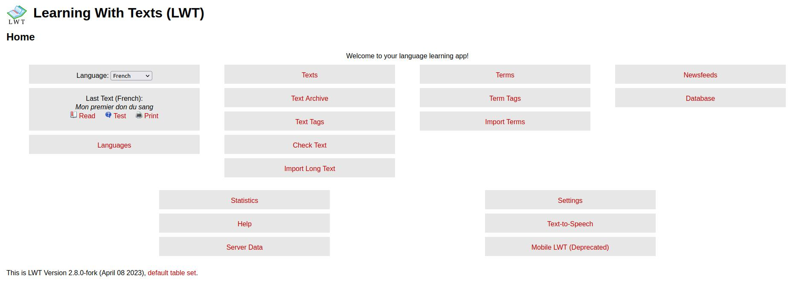  

This is normal home screen of LWT. You may choose a language here, but you can do this also later. If you you choose a language, the language filter is pre-set to that language in some other screens. The last text you've read or tested is shown, and you may jump directly into reading, testing or printing of this last text.  

## Languages

The list of languages. Here you can add a new or edit an existent language. If no texts and no saved terms in a language exist, you can delete a language. If you change a language, all texts may be automatically reparsed to refresh (and correct) the cache of sentences and text items (depends on what language settings you have changed). You can do this also manually by clicking on the yellow flash icon. You can also test all (due) terms of a language or set a language as "current" language.  

  

### New/Edit Language

This is the place to define or edit a language you want to study.

It is recommended to use the "Language Settings Wizard" first. You only select your
native (L1) and study (L2) languages, and let the wizard set all language settings
that are marked in yellow. You can always adjust the settings afterwards.  

**Explanations of the input fields** - please read also [this section](info.html#langsetup):  

The three [URLs](https://en.wikipedia.org/wiki/URL) are URLs to three web dictionaries (the second and third is optional). Use ``lwt_term`` as a placeholder for the search word in the URIs. If ``lwt_term`` is missing, the search word will be appended to the end. If the URI to query "travailler" in WordReference is "<http://www.wordreference.com/fren/travailler>", you may enter: "http&#58;&#47;&#47;www&period;wordreference&period;com&#47;fren&#47;lwt_term" or "<http://www.wordreference.com/fren/>". Another example: The URI to query "travailler" in sensagent is "<http://dictionary.sensagent.com/travailler/fr-en/>", so you enter in LWT "http&#58;&#47;&#47;dictionary&period;sensagent&period;com/lwt_term/fr-en/".  

As URI No. 3 ("Translator") is also used to translate whole sentences. It is recommended to use either [Google Translate](https://translate.google.com) or [LibreTranslate](https://libretranslate.com/).

* Generic URL for Google Translate: "http&#58;&#47;&#47;translate.google.com/?ie=UTF-8&sl=..&tl=..&text=lwt_term", where the two-character codes after "sl=" and "tl=" designate the [language codes (or "subtags")](http://www.iana.org/assignments/language-subtag-registry) for the source and the target language.
* Generic URL for LibreTranslate: "http&#58;&#47;&#47;localhost:5000/?lwt_translator=libretranslate&source=..&target=..&q=lwt_term".
  * Use "source=" and "target=" to set languages.
  * It is **required** to set "lwt_translator=libretranslate" if you want to use automatic translation features.

A different third web dictionary is of course possible, but sentence translations may not work.  

**IMPORTANT:** Some dictionaries (including "Google Translate") don't allow to be opened within a frame set. Put an asterisk \* in front of the URI (Examples: \*<http://mywebdict.com?q=###> or \*<http://translate.google.com/?ie=UTF-8&sl=..&tl=..&text=###)> to open such a dictionary not within the frame set but in a popup window (please don't forget to deactivate popup window blocking in your browser!).  

#### Deprecated Features

##### Specify Encoding

**This feature has been abandonned, do not use it**!

If the searchword in the three URIs needs to be converted into a different encoding (standard is UTF-8), you could use ###encoding### as a placeholder. Normally you see this right away if terms show up wrongly in the web dictionary. Example: Linguee expects the searchword in ISO-8859-15, not in UTF-8, so you define it this way: "http&#58;&#47;&#47;www.linguee.de/search?direction=auto&query=###ISO-8859-15###". A list of encodings can be found [here](http://php.net/manual/en/mbstring.supported-encodings.php).

##### Glosbe API

Glosbe closed there API, this feature does no longer work.

One dictionary ([Glosbe](http://glosbe.com/)) has been closely integrated into LWT via the Glosbe API. To use this dictionary, input the "special" dictionary link "http&#58;&#47;&#47;localhost/lwt/glosbe\_api.php?from=...&dest=...&phrase=lwt\_term" with _from_: "L2 language code" (the language of your texts) and _dest_: "L1 language code" (e.g. mother tongue). To find the language codes, open [this page](http://glosbe.com/all-languages) to select the "from" (L2) language. On the next page, select the "L2 - L1" language pair. The URL of the next page shows the two language codes, here as an example "French - English": http&#58;&#47;&#47;glosbe.com/**fr**/**en**/. The "from" code is "fr", the "dest" code is "en". Using this dictionary makes the transfer of translation(s) from the Glosbe to LWT very easy: just click on the icon next to the translations to copy them into the LWT edit screen. I recommend to use the LWT-integrated Glosbe dictionary as the "Dictionary 1 URI". Note: I cannot guarantee that the Glosbe API and this special integration will work in the future! glosbe\_api.php is just an example how one can integrate a dictionary into LWT.  

You don't know how and where to find a good web dictionary? Try these dictionary directories:

* [http://www.alphadictionary.com/langdir.html](http://www.alphadictionary.com/langdir.html)
* [http://dir.yahoo.com/reference/dictionaries/](http://dir.yahoo.com/reference/dictionaries/)
* [http://www.dmoz.org/Reference/Dictionaries/](http://www.dmoz.org/Reference/Dictionaries/)
* [http://www.lexicool.com/](http://www.lexicool.com/)

If you have found a suitable web dictionary, try to translate some words and look whether the word is part of the web address (URI/URL). If yes, replace the word with ### and put this in one of the URI fields within LWT.  

The entry "Text Size" defines the relative font size of the text. This is great for Chinese, etc.  

"Character Substitutions" is an optional list of "from=to" items with "|" as list separator. The "from" character is replaced by the "to" character ("to" may be also empty). So different kinds of apostrophes can unified or deleted.  

"RegExp Split Sentences" is a list of characters that signify a sentence ending (ALWAYS together with a following space or newline!). The space can be omitted (and it is normally), if you set "Make each character a word" to Yes (see below). Whether you include here ":" and ";" - that's your decision. See also [this table](info.html#langsetup). Characters can be also defined in [Unicode](http://en.wikipedia.org/wiki/Unicode) form: "\\x{....}"; the Chinese/Japanese full stop "。" is then "\\x{3002}" (always without "). Please inform yourself about Unicode [here (general information)](http://en.wikipedia.org/wiki/Unicode) and [here (Table of Unicode characters)](http://unicode.coeurlumiere.com/).  

"Exceptions Split Sentences" are a list of exceptions that are NOT to be treated as sentence endings with "|" as list separator. \[A-Z\] is a character range. If you don't want to split sentences after Mr. / Dr. / A. to Z. / Vd. / Vds. / U.S.A., then you should specify these here: "Mr.|Dr.|\[A-Z\].|Vd.|Vds.|U.S.A." (without ").  

"RegExp Word Characters" is a list of characters OR character ranges "x-y" that defines all characters in a word, e.g. English: "a-zA-Z", German: "a-zA-ZaöüÄÖÜß", Chinese: 一-龥. See also [this table](info.html#langsetup). Characters can be also defined in [Unicode](http://en.wikipedia.org/wiki/Unicode) form: "\\x{....}"; the Chinese/Japanese character "one" "一" is then "\\x{4E00}" (always without "). So the above specification for the range of characters in Chinese "一-龥" can also be specified: "\\x{4E00}-\\x{9FA5}".

* The value "mecab" is special as it will use MeCab to process japanese. You can ignore subsequent fields.

"Make each character a word" is a special option for Chinese, etc. This makes EVERY character a single word (normally words are split by any non-word character or a space). See also [this table](info.html#langsetup).  

"Remove spaces" is another option for Chinese, etc. It removes all spaces from the text (and the example sentences). See also [this table](info.html#langsetup).  

"Right-To-Left Script" must be set to "Yes" if the language/script is written from right to left, like Arabic, Hebrew, Farsi, Urdu, etc.  

"Export Template". The export template controls "Flexible" Term Exports for the terms of that language. It consists of a string of characters. Some parts of this string are placeholders that are replaced by the actual term data, [see this table](export_template.html). For each term (word or expression), that has been selected for export, the placeholders of the export template will be replaced by the term data and the string will be written to the export file. If the export template is empty, nothing will be exported.

To understand all these options, please study also [this](info.html#langsetup), look at the examples and play around with different settings and different texts.  

  

## Texts

The list of texts. You can filter this list according to language, title (wildcard = \*) or text tag(s) (see also below). The most important links for each text are "Read" and "Test" - that's the place to read, to listen, to save terms and to review and test your terms in sentence context. To see all terms of a text that you have saved, click on the numbers in column "Saved Wo+Ex". To print, archive, edit (and reparse), or to delete a text, click on the icons in column "Actions". There are more actions available, see "Multi Actions".  

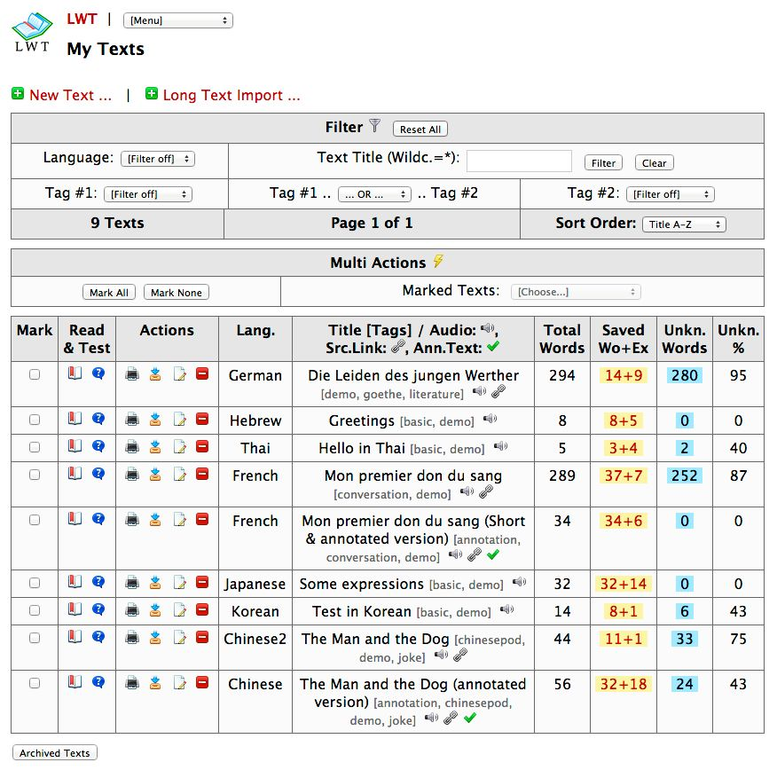  

### Multi Actions for marked texts

You can test the terms of the marked texts, delete or archive the marked texts. "Reparse Texts" rebuilds the sentence and the text item cache for all marked texts. "Set Term Sentences" sets a valid sentence (with the term in {..}) for all those saved or imported terms that occur in the text and that do not have a sentence at all or none with {term}. This makes it easy to "create" sentence examples for imported terms.  

  

## Text Tags

The list of your text tags. You can manage your text tags here. With text tags, it will be easier to categorize and organize your texts. The tags are case sensitive, have 1 to 20 characters, and must not contain any spaces or commas.  

  

### New/Edit Text

This is the screen to input, check or edit a single text. Try to store not too long texts (the maximum length is 65,000 Bytes). If texts are very long (> 1000 words), certain operations (e.g. loading a text for reading, calculation of known/unknown words) may be quite slow. An audio URI and a link to the text source can also be defined. The best place to store your audios is the "media" subdirectory below the installation directory "lwt" (you have to create it yourself, and you have to copy the audio files into this directory; click Refresh if you don't see just copied media). But a cloud webspace service like DropBox is also possible. In the moment there is no possibility to import/upload an audio file within the LWT application. By the way, you can use MP3, WAV, or OGG media files, but be aware that not all browsers and/or operating systems support all media types!

If you click "Check", the text will be parsed and split into sentences and words according to your language settings. Nothing will be stored if you check a text. You can see whether your text needs some editing, or whether your language settings (especially the ones that influence parsing/splitting) need an adjustment. Words (not expressions) that are already in your word list are displayed in red, and the translation is displayed. The Non-Word List shows all stuff between words. The "Check a Text" function can also be started directly from the main menu. If you click on "Change" or "Save", the text will be only saved. If you click on "Change and Open" or "Save and Open", the text will be saved and opened right away.  

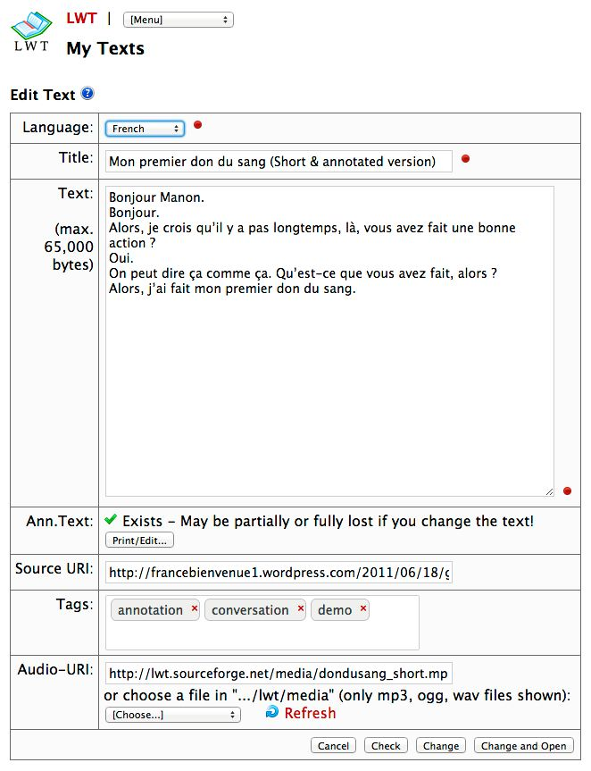  

You can also import a longer text into LWT with the possibility to split it up into several smaller texts. Click on "Long Text Import". You must specify the maximum number of sentences per text, and the handling of newlines for paragraph detection. It is not possible to specify audio files or URIs.  

  

## Newsfeed

### Newsfeed Import

Here you can download the articles of your newsfeeds (HowTo add a new newsfeed see [here](info.html#new_feed)). If you've set up multiple newsfeeds for your selected language, the link "update multiple feeds" will appear. By clicking that link you can update one or more feeds at once. If you've selected a newsfeed, a blue circle-arrow will appear as well as the date of your last update. A click on the circle-arrow will update your selected newsfeed. All downloaded articles will be marked by a bookmark-icon instead of the checkbox, so you can access them immediately. If a downloaded article is archived, a red mark will appear. An error may occur, when you try to download an article and the link or the text-section of the article is not found. Then a yellow warning sign appears, which can be removed temporarily by clicking on it or permanently in [Manage Feeds](info.html#man_feed). If you hover over an article title, a description of the article will be shown. You can open the article and, if available, the audio in a new window.  

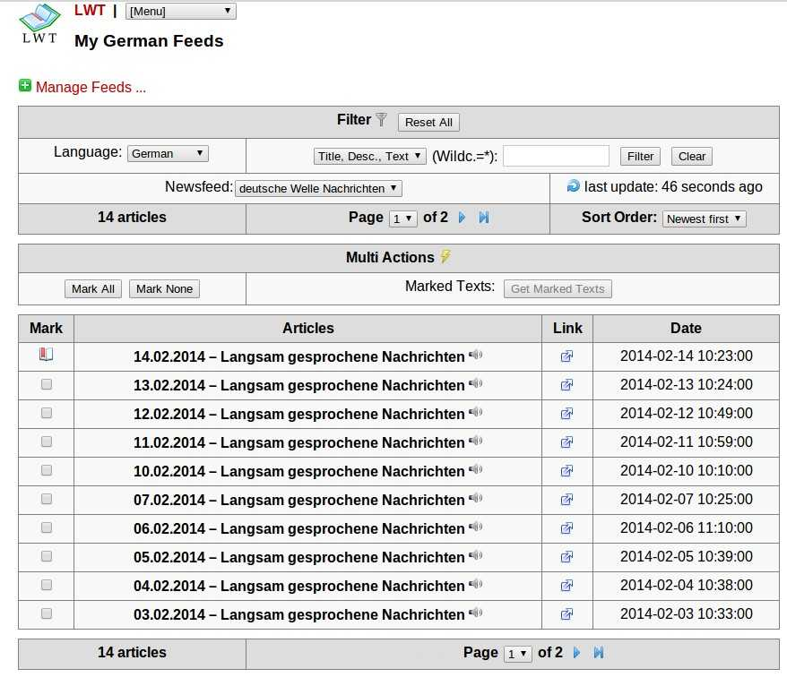  

### Manage Feeds

Multi Actions for marked newsfeeds: You can update feeds, unset unloadable articles (see [my newsfeeds](info.html#feed_imp)), delete all articles or delete feeds.  
Actions: You can edit, update, delete a feed or follow the link to the newsfeed.  

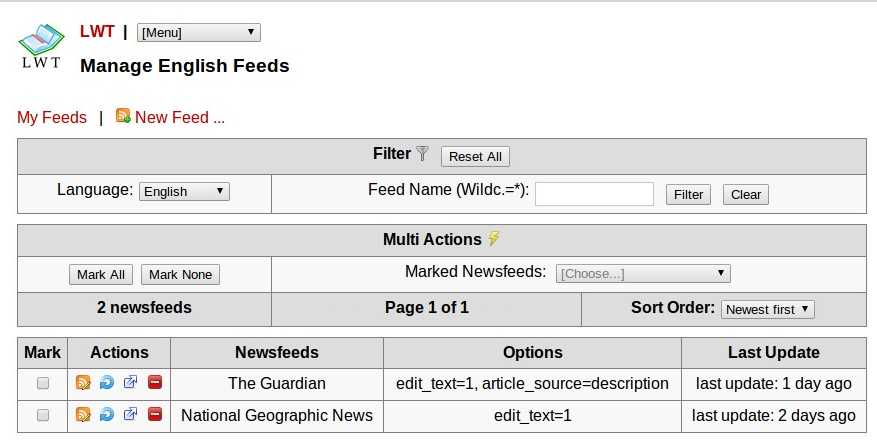  

### New/Edit Feeds

Explanations of the input fields

* Language: select your language, it can be changed later.
* Name: the name is limited to 40 characters, this field must not be empty.
* Newsfeed url: URL of your RSS/Atom-Feed, this field must not be empty.
* Article Section: [xpath expression](http://www.w3.org/TR/xpath20/) (i.e.: //div\[@id="content-to-read"\]/p), the [feed wizard](info.html#feed_wizard) can be used to get the right sections, this field must not be empty.
* Filter Tags: [xpath expression](http://www.w3.org/TR/xpath20/), the [feed wizard](info.html#feed_wizard) can be used to get the right sections.
* Options:
  * Edit Text: if this is checked, you can edit your articles before saving.
  * Auto Update Interval: your feed will be updated automatically, when you enter MY FEEDS from the main menu.
  * Max. Links: number of shown in MY FEEDS, if this is empty, the value in the settings will be used.
  * Charset: this should be empty, charset sould be detected automatically.
  * Max. Texts: max. number of active texts, if this is empty, the value in the settings will be used. Older texts will be moved into ARCHIVE.
  * Tag: you can give the texts a tag, if this is empty, the first 20 characters of the feed name will be used. The tag will be used to move the older texts into ARCHIVE. Each feed should have its own tag.
  * Article Source: some feeds have its texts integrated in the description. The articles can be cached in the database, which results in a faster download and a bigger database. Feeds with cached articles should have less Max. Links. The feed wizard can be used to detect the Article Source. If this is unchecked, each article will be downloaded from the internet.

      

### Feed Wizard  

Here you can edit or set up a new newsfeed in 4 steps.  

1. Insert your newsfeed url. This step is skipped, when you edit a newsfeed.
2. Step 2

    * Name: the name is limited to 40 characters, this can be changed later in step 4 and must not be empty.
    * Newsfeed url: URL of your RSS/Atom-Feed, this can only be changed in step 1 and must not be empty.
    * Article Source: Webpage Link means, that the article will downloaded from the link, all other values mean, that the texts are cached in the database, when you update your feed. You must set the value, before you set the article section. This can only be changed here.

    **How to select the article section:**  

    When you click on the text, it will be marked yellow and a value in the right selectbox will appear. You can change the marked section by selecting a value. If you click on the yellow marked text, the text will be unmarked. To select a text click the "get"-button. The xpath expression of the selected text will then appear on the top and the text will be marked green. You can unselect the selected text by clicking on the red cross. If you click on the xpath expression or on the selected text, a border around the selected text will appear. This can be used to verify the connection between text and xpath exp. in the articles. In order to change an article/webpage use the selectbox on the left. All visited articles start with an arrow "▶". Articles from different hosts probably contain different article sections. Therefore a selectbox can be used to mark the hosts, that are "done", with a star. By clicking on the setting icon, you can choose between three selection modes. "Smart Selection" looks for ids and classes in the element node and parent node. "Get All Attributes" will compare all attributes of the element node/parent node with the text. This mode is not recommended. "Advanced Selection" lets you customize the [xpath expression](http://www.w3.org/TR/xpath20/).  

    

3. This works like step 2. Only the selected sections from step 2 are clickable. Marked text will appear grey, filtered texts will have a red font.  

      

4. The settings are explained in [New/Edit Feeds](#new_feed).  

## Read a Text

This is your "working area": Reading (and listening to) a text, saving/editing words and expressions, looking up words, expressions, sentences in external dictionaries or Google Translate. To create an expression, click on the first word. You see "Exp: 2..xx 3..yy 4..zz ...". Just click on the number of words (2..9) of the desired expression you want to save. The dictionary links for multi word expressions are always in the edit frame! You can also use the Keyboard in the text frame, see [Key Bindings](info.html#keybind). Double clicking on a word sets the audio position approximately to the text position, if an audio was defined. The other audio controls are self-explanatory: automatic repeat, rewind and move forward n seconds, etc.).  

  

Reading a Right-To-Left Script (Hebrew):  

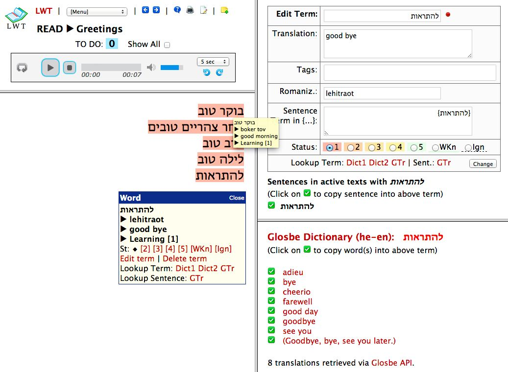  

With the checkbox \[Show All\] you can switch the display of text:  

\[Show All\] = ON (see below): All terms are shown, and all multi-word terms are shown as superscripts before the first word. The superscript indicates the number of words in the multi-word term.  

  

\[Show All\] = OFF (see below): Multi-word terms now hide single words and shorter or overlapping multi-word terms. This makes it easier to concentrate on multi-word terms while displaying them without superscripts, but creation and deletion of multi-word terms can be a bit slow in long texts.  

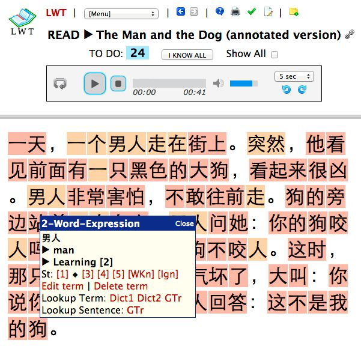  

## Test terms

Tests are only possible if a term has a translation. Terms with status "Ignored" and "Well Known" are never tested, and terms with a positive or zero score are not tested today. In summary, the term score must fall below zero to trigger the test. See also [Term scores](info.html#termscores). Terms that are due today are marked with a red bullet in the term table. Terms that are due tomorrow are marked with a yellow bullet in the term table.  

During a test, a status display (at the bottom of the test frame) shows you the elapsed time "mm:ss", a small bar graph, and the total, not yet tested, wrong and correct terms in this test.  

In the following, L1 denotes you mother tongue (= translations), and L2 the language you want to learn (= the terms (words and expressions).

### Test terms in a text (L2 -> L1)

This is Test #1 or #4: L2 -> L1 (recognition) - to train your ability to recognize a L2 term. You may test within sentence context (Button "..\[L2\].."), or just the term (Button "\[L2\]"). You can also use the Keyboard in the test frame, see [Key Bindings](info.html#keybind).  

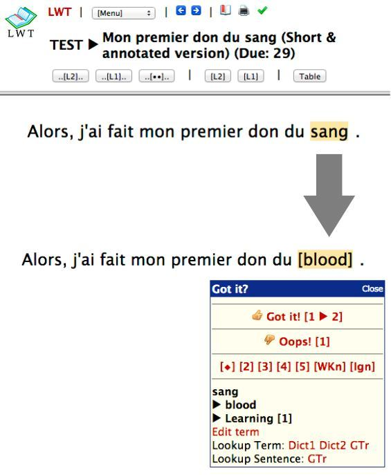  

### Test terms in a text (L1 -> L2)

This is Test #2 or #5: L1 -> L2 (recall) - to train your ability to produce a term from L1. You may test within sentence context (Button "..\[L1\].."), or just the term (Button "\[L1\]"). You can also use the Keyboard in the test frame, see [Key Bindings](info.html#keybind).  

  

### Test terms in a text (••• -> L2)

This is test #3: ••• -> L2 (recall) - to train your ability to produce a term only from the sentence context (Button "..\[••\].."). If you hover over "\[•••\]", a tooltip displays the translation of the term. You can also use the Keyboard in the test frame, see [Key Bindings](info.html#keybind).  

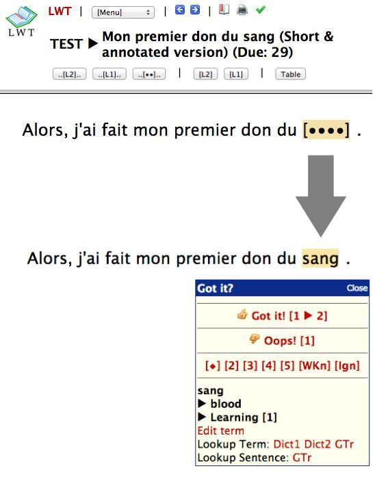  

### Test yourself in a table / word list format (Button "Table")

This is test #6: The selected terms and expressions are presented as a table. You can make invisible either the columns "Term" or "Translation", and you can hide or show the columns "Sentence", "Romanization", "Status" and "Ed" (Edit). To reveal the invisible solution ("Term" or "Translation"), you just click into the empty table cell. You can review or test yourself with or without changing the status by clicking "+" or "-" in the "Status" column. A status in red signifies that the term is due for testing. You can also edit the term by clicking the yellow "Edit" icon. Columns 2 to 6 may also my sorted by clicking on the header row. The initial sort order is according to term score.  

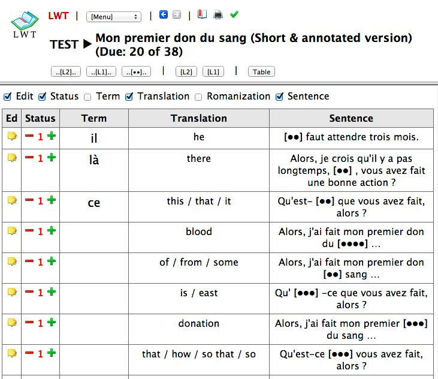  

## Print a text

Here you print a text. Optional: an inline annotation (translation and/or romanization) of terms that are of specified status(es). This screen is also great to just read or study a text.  

Chinese Text with annotation (Romanization/Pinyin and translation):  

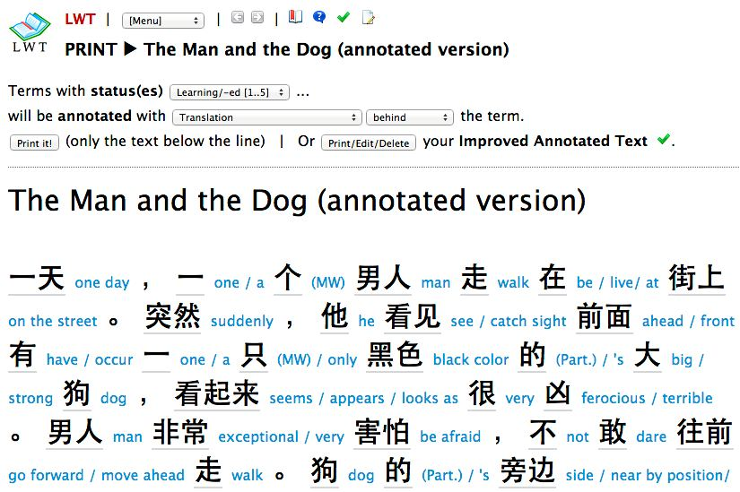  

Chinese Text with annotation (only Romanization/Pinyin):  

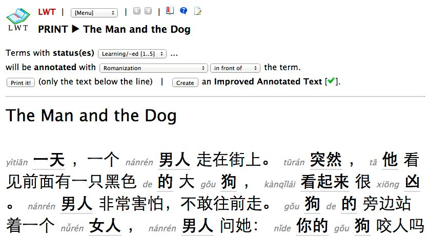  

## Create, edit, and use an _Improved Annotated Text_

**Motivation:** Annotated texts (as [interlinear text](http://en.wikipedia.org/wiki/Interlinear_gloss)) have been used for language learning for a long time. One example are the word-by-word translations in [Assimil](http://en.assimil.com/) courses. The German [V. F. Birkenbihl](http://web.archive.org/web/20070223080453/http://195.149.74.241/BIRKENBIHL/PDF/MethodEnglish.pdf) proposes the creation of interlinear word-by-word or [hyperliteral](http://learnanylanguage.wikia.com/wiki/Hyperliteral_translations) translations (calling this creation "decoding") in foreign language learning. Learning Latin or Ancient Greek via interlinear texts is quite old as you can see in [this YouTube video](http://www.youtube.com/watch?v=XnEKnezLXJg).  

LWT's old "Print Screen" offers annotations, but it displays ALL translations of a term. The _Improved Annotated Text_ feature enables you to select the best translation for every word in the text. As a result, you create an L1 word-by-word translation that is displayed above the L2 text. This interlinear text is better suited for language study, especially for beginners.  

**Method:** While listening to the audio, first follow the blue annotations in your native language while listening and understanding. Later, after understanding the text fully, you read the foreign language text alone. Repeat this often. After these steps, you listen to the text passively or do shadowing.  

On the Print Screen, click on "Create" an Improved Annotated Text. The system creates a default annotated text.  

### Edit Mode

  

Within the "Improved Annotated Text - Edit Mode", you can select the best term translation by clicking on one of the radio buttons. To be able to do this, multiple translations must be delimited by one of the delimiters specified in the LWT Settings (currently: /;|). You can also type in a new translation into the text box at the end (this does not change your saved term translation), or you may change your term by clicking on the yellow icon or add a translation by clicking on the green "+" icon (this does change your saved term translation), and select it afterwards. The "Star" icon indicated that you want the term itself as annotation. **Important:** It's not possible to create new terms here - please do this in the "Read text" screen. Changing the language settings (e.g. the word characters) may have the effect that you have to start from scratch. The best time for the creation of an improved annotated text is after you have read the text completely and created all terms and expressions in the "Read text" screen.  

**Warning:** If you change the text, you will lose the saved improved annotated text! All changes in the Edit screen are saved automatically in the background!

To leave the Edit mode, click on "Display/Print Mode". You may then print or display (with audio) the text, and work with the text online or offline.  

### Print Mode

  

### Display Mode

With audio player in a separate window. Clicking the "T" or "A" lightbulb icons hides/shows the text or the blue annotations. You may also click on a single term or a single annotation to show or to hide it. This enables you to test yourself or to concentrate on one text only. Romanizations, if available, appear while hovering over a term.  

  

## Terms

The list of your saved words or expressions (= terms). You may filter the list of terms by language, text, status, term/romanization/translation (wildcard \* possible) or term tag(s). Different sort orders are possible. You can do "multi actions" only on the marked or on all terms (on all pages!). "Se?" displays a green dot if a valid sentences with {term} exists. "Stat/Days" displays the status and the number of days since the last status change. The score of a term is a rough measure (in percent) how well you know a term. Read more about term scores [here](info.html#termscores). Terms with zero score are displayed red and should be tested today.  

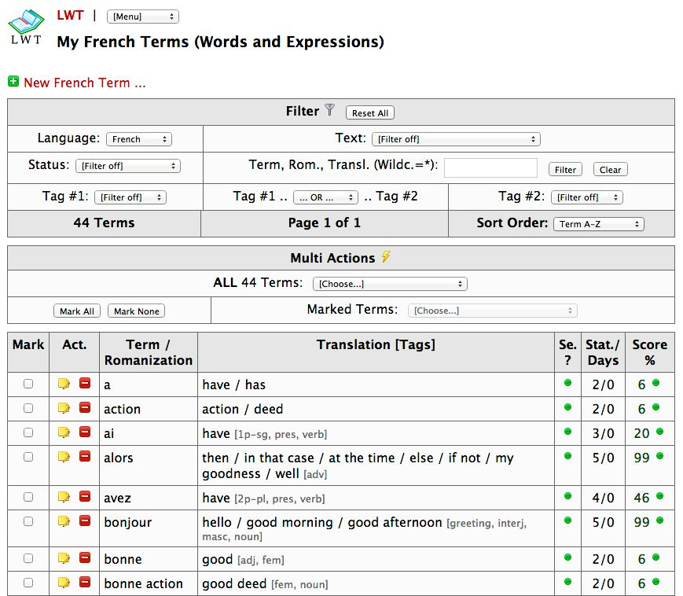  

### Multi Actions for marked terms

Most actions are self-explanatory. "Test Marked Terms" starts a test with all marked terms. You may delete marked terms and change the status of marked terms. "Set Status Date to Today" is some kind of "trick" for vacations, illnesses, etc.  

"Export Marked Texts (Anki)" exports all terms that have been marked AND have a valid sentence with {term} for Anki. Terms that do not have a sentence with {term} will NOT be exported. Cloze testing of terms within sentence context can so be easily done in Anki. The export is tab-delimited: (1) term, (2) translation, (3) romanization, (4) Sentence without term (question of cloze test), (5) Sentence with term (answer of cloze test), (6) Language, (7) ID Number, (8) Tag list. Anki template decks (for Anki Version 1 and 2) are provided: "LWT.anki" and "LWT.apkg" in directory "anki".  

"Export Marked Texts (TSV)" exports all terms that have been marked. The export is tab-delimited: (1) term, (2) translation, (3) sentence, (4) romanization, (5) status, (6) language, (7) ID Number, (8) tag list.  

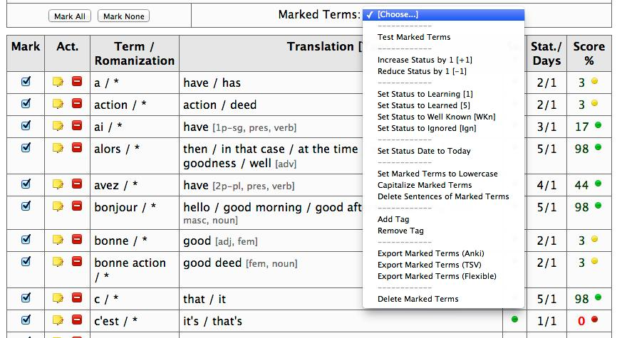  

### Multi Actions for all terms on all pages of the current query

Explanations see above.  

  

## Term Tags  

The list of your term tags. You can manage your term tags here. With term tags, it will be easier to categorize and organize your terms. The tags are case sensitive, have 1 to 20 characters, and must not contain any spaces or commas.  


## Text Archive  

The list of archived texts. To unarchive, to edit or to delete a text, click on the icon under "Actions". There are also "Multi Actions" available.  

What is the difference between (active) texts and archived texts?  

### (Active) texts

* They have been parsed and tokenized according to the rules defined for the language.
* The result is stored in a cache of sentences and text items.
* They use a lot of space in the database.
* Reading with term creation/editing and dictionary lookup is possible.
* Testing of a stored term that occurs in the text, is possible. A terms will be tested within the context of any sentence(s) in all active texts (the number of sentences may be set (1, 2, or 3) as a preference).

### Archived texts

* They are not parsed and tokenized, only the text is stored.
* Compared with active texts, they don't use much space in the database, because no sentences and no text items are stored.
* Reading with term creation/editing and dictionary lookup is not possible.
* Testing of a stored term, that occurs in the text, is possible, but a term will be tested ONLY within the context of the sentence(s) that has/have been stored with the term in the sentence field, if the term does not occur in any active text.

  

Multi Actions for marked archived texts

  

## Statistics  

It's self-explanatory and shows your performance. The numbers in the first table are links, by clicking on them you jump to the table of all terms in that status and language.  

  

## Import Terms  

Import a list of terms for a language, and set the status for all to a specified value. You can specify a file to upload or type/paste the data directly into the textbox. Format: one term per line, fields (columns) are separated either by comma ("CSV" file, e.g. used in LingQ as export format), TAB ("TSV" file, e.g. copy and paste from a spreadsheet program, not possible if you type in data manually) or # (if you type in data manually). The field/column assignment must be specified on the left.

Important: You must import a term. The translation can be omitted if the status should be set to 98 or 99 (ignore/well known). Translation, romanization and sentence are all optional, but please understand that tests are only possible if terms have a translation. If a term already exists in the database (comparison is NOT case sensitive), it will not be overwritten; the line will be ignored. You can change this by setting "Overwrite existent terms" to "Yes". Be careful using this screen, a database backup before the import and double-checking everything is always advisable!  

  

## Database

This screen offers a possibility to save, restore or empty the LWT database (ONLY the current table set!). This makes it easy to try out new things or just to make regular backups. "Restore" only accepts files that have been created with the "Backup" function above. "Empty Database" deletes the data of all tables (except the settings) of the current table set, and you can start from scratch afterwards. Be careful: you may lose valuable data!  

  

## Settings

In this screen you can adjust the program according to your needs. The geometric properties of the _Read Text_ and _Test_ screens can be changed. This is important because different browsers and font sizes may result in an unpleasant viewing experience.

The waiting time to display the next test and to hide the old message after a test assessment can be changed.

The number of sentences displayed during testing and generated during term creation can be set to 1 (default), 2 or 3; if set to 2 or 3 you are able to do "MCD" (Massive-Context Cloze Deletion) testing, proposed by Khatzumoto @ AJATT.

The number of items per page on different screens can be set, and you can decide whether you want to see the word counts on the textpage immediately (page may load slow) or later (faster initial loading).  

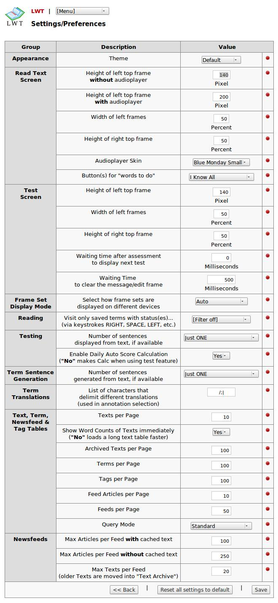  

## Multiple LWT table sets

**WARNINGS**:

* The use of the "Multiple LWT table sets" feature on an external web server may cause a **monstrous database size** if some users import many or large texts. LWT with activated "Multiple LWT table sets" is in its current version **not suitable** to be run in a public environment on an external web server!
* Another better system may be implemented, use this feature at your own risks!  

When you start using LWT, you store all your data in the "Default Table Set" within the database you have defined in the file "connect.inc.php" during the LWT installation.  

Beginning with LWT Version 1.5.3, you are able to create and to use unlimited LWT table sets within one database (as space and MySQL limitations permit). This feature is especially useful for users who want to set up a multi user environment with a set of tables for each user. You can also create one table set for every language you study - this allows you to create different term/text tags for each language. If you don't need this feature, you just use LWT like in earlier versions with the "default table set". Please observe that the "Backup/Restore/Empty Database" function only works for the CURRENT table set, NOT for ALL table sets you have created!  

Just click on the link at the bottom of the LWT home screen where the current table set name (or "Default") is displayed. In a new screen "Select, Create or Delete a Table Set" you may switch and manage table sets. A table set name is max. 20 characters long. Allowed characters are only: a-z, A-Z, 0-9, and the underscore "\_".  

  

If you want "switch off" this feature, and use just one table set, you may define the name in the file "connect.inc.php":  

```php
$tbpref = "";          // only the default table set  
$tbpref = "setname";   // only the table set "setname"  
```

After adding such a line in the file "connect.inc.php", you are not able to select, create or delete table sets anymore. Only the one you have defined in "connect.inc.php" will be used. Please observe the rules for table set names (see above)!

If more than one table set exists, and $tbpref was NOT set to a fixed value in "connect.inc.php", you can select the desired table set via "start.php" (use this as start page if several people use their own table set), or by clicking on the LWT icon or title in the LWT menu screen "index.php".

By hovering over the LWT icon in the top left corner of every screen, you can display the current table set in a yellow tooltip.
